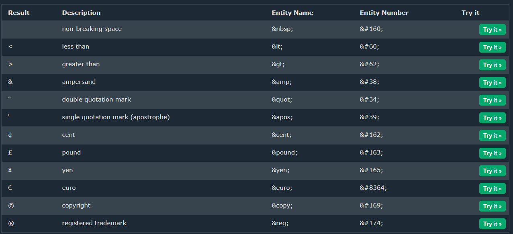

# 01 HTML

## 0 教程简介

结合三个教程一起学习:

1. [w3schools的HTML教程](https://www.w3schools.com/html/default.asp)
2. [MDN的的HTML指南](https://developer.mozilla.org/zh-CN/docs/Learn/HTML)
3. [B站的尚硅谷前端html+css零基础教程，2023最新前端html5+css3视频](https://www.bilibili.com/video/BV1p84y1P7Z5/?spm_id_from=333.337.search-card.all.click&vd_source=6e9c2de5b89c2ba4e13469e295319397)

### 1 w3schools HTML Tutorial

#### 1.1 HTML Tutorial

[HTML HOME](https://www.w3schools.com/html/default.asp)(2023.07.13-复习)

[HTML Introduction](https://www.w3schools.com/html/html_intro.asp)(2023.07.13-复习)

[HTML Editors](https://www.w3schools.com/html/html_editors.asp)(2023.07.13-复习)

[HTML Basic](https://www.w3schools.com/html/html_basic.asp)(2023.07.13-复习)

[HTML Elements](https://www.w3schools.com/html/html_elements.asp)(2023.07.13-复习)

[HTML Attributes](https://www.w3schools.com/html/html_attributes.asp)(2023.07.13-复习)

[HTML Headings](https://www.w3schools.com/html/html_headings.asp)(2023.07.13-复习)

[HTML Paragraphs](https://www.w3schools.com/html/html_paragraphs.asp)(2023.07.13-复习)

The browser will automatically remove any extra spaces and lines when the page is displayed:


| Tag                                                 | Description                              |
| :-------------------------------------------------- | :--------------------------------------- |
| [<p>](https://www.w3schools.com/tags/tag_p.asp)     | Defines a paragraph                      |
| [<hr>](https://www.w3schools.com/tags/tag_hr.asp)   | Defines a thematic change in the content |
| [<br>](https://www.w3schools.com/tags/tag_br.asp)   | Inserts a single line break              |
| [<pre>](https://www.w3schools.com/tags/tag_pre.asp) | Defines pre-formatted text               |

[HTML Styles](https://www.w3schools.com/html/html_styles.asp)(2023.07.13-复习)

[HTML Formatting](https://www.w3schools.com/html/html_formatting.asp)(2023.07.13-复习)

| Tag                                                       | Description                                          |
| :-------------------------------------------------------- | :--------------------------------------------------- |
| [<b>](https://www.w3schools.com/tags/tag_b.asp)           | Defines bold text                                    |
| [<em>](https://www.w3schools.com/tags/tag_em.asp)         | Defines emphasized text                              |
| [<i>](https://www.w3schools.com/tags/tag_i.asp)           | Defines a part of text in an alternate voice or mood |
| [<small>](https://www.w3schools.com/tags/tag_small.asp)   | Defines smaller text                                 |
| [<strong>](https://www.w3schools.com/tags/tag_strong.asp) | Defines important text                               |
| [<sub>](https://www.w3schools.com/tags/tag_sub.asp)       | Defines subscripted text                             |
| [<sup>](https://www.w3schools.com/tags/tag_sup.asp)       | Defines superscripted text                           |
| [<ins>](https://www.w3schools.com/tags/tag_ins.asp)       | Defines inserted text                                |
| [<del>](https://www.w3schools.com/tags/tag_del.asp)       | Defines deleted text                                 |
| [<mark>](https://www.w3schools.com/tags/tag_mark.asp)     | Defines marked/highlighted text                      |

[HTML Quotations](https://www.w3schools.com/html/html_quotation_elements.asp)(2023.07.13-复习)

| Tag                                                          | Description                                                  |
| :----------------------------------------------------------- | :----------------------------------------------------------- |
| [<abbr>](https://www.w3schools.com/tags/tag_abbr.asp)        | Defines an abbreviation or acronym                           |
| [<address>](https://www.w3schools.com/tags/tag_address.asp)  | Defines contact information for the author/owner of a document |
| [<bdo>](https://www.w3schools.com/tags/tag_bdo.asp)          | Defines the text direction                                   |
| [<blockquote>](https://www.w3schools.com/tags/tag_blockquote.asp) | Defines a section that is quoted from another source         |
| [<cite>](https://www.w3schools.com/tags/tag_cite.asp)        | Defines the title of a work                                  |
| [<q>](https://www.w3schools.com/tags/tag_q.asp)              | Defines a short inline quotation                             |

[HTML Comments](https://www.w3schools.com/html/html_comments.asp)(2023.07.13-复习)

[HTML Colors](https://www.w3schools.com/html/html_colors.asp)(2023.07.13-复习)

| Color       | example                | Description                                                  |
| ----------- | ---------------------- | ------------------------------------------------------------ |
| Color Names | Red,Tomato,etc         |                                                              |
| RGB         | rgb(255, 99, 71)       | red,green,blue                                               |
| RGBA        | rgb(255, 99, 71,0.5)   | red,green,blue,alpha(透明度)                                 |
| HEX         | #ff6347                | #rrggbb                                                      |
| HSL         | hsl(0, 100%, 50%)      | hue(色调):0-red,120-green,240-blue,saturation(饱和度),lightnes(亮度) |
| HSLA        | hsl(0, 100%, 50%, 0.5) | hue(色调),saturation(饱和度),lightnes(亮度),alpha(透明度)    |

[HTML CSS](https://www.w3schools.com/html/html_css.asp)(2023.07.13-复习)

[HTML Links](https://www.w3schools.com/html/html_links.asp)(2023.07.13-复习)

```html
target
<a href="https://www.w3schools.com/" target="_blank">Visit W3Schools!</a>
_self - Default. Opens the document in the same window/tab as it was clicked
_blank - Opens the document in a new window or tab
_parent - Opens the document in the parent frame
_top - Opens the document in the full body of the window

img
<a href="default.asp">

</a>

title
<a href="https://www.w3schools.com/html/" title="Go to W3Schools HTML section">Visit our HTML Tutorial</a>

mailto:
<a href="mailto:someone@example.com">Send email</a>

bookmark
<a href="html_demo.html#C4">Jump to Chapter 4</a>
```

```html
<style>
a:link {
  color: green;
  background-color: transparent;
  text-decoration: none;
}

a:visited {
  color: pink;
  background-color: transparent;
  text-decoration: none;
}

a:hover {
  color: red;
  background-color: transparent;
  text-decoration: underline;
}

a:active {
  color: yellow;
  background-color: transparent;
  text-decoration: underline;
}
</style>
```

[HTML Images](https://www.w3schools.com/html/html_images.asp)(2023.07.13-复习)

```html
image map

<map name="workmap">
  <area shape="rect" coords="34,44,270,350" alt="Computer" href="computer.htm">
  <area shape="rect" coords="290,172,333,250" alt="Phone" href="phone.htm">
  <area shape="circle" coords="337,300,44" alt="Coffee" href="coffee.htm">
</map>

picture tag
<picture>
  <source srcset="img_avatar.png">
  <source srcset="img_girl.jpg">
  
</picture>
```

[HTML Favicon](https://www.w3schools.com/html/html_favicon.asp)(2023.07.13-复习)

```html
write inside head tag 
<link rel="icon" type="image/x-icon" href="/images/favicon.ico">
```

[HTML Page Title](https://www.w3schools.com/html/html_page_title.asp)(2023.07.13-复习)

[HTML Tables](https://www.w3schools.com/html/html_tables.asp)(未复习)

[HTML Lists](https://www.w3schools.com/html/html_lists.asp)(2023.07.13-复习)

```html
<ul>
  <li>Coffee</li>
  <li>Tea</li>
  <li>Milk</li>
</ul>

attribute: type, start, list-style-type
<ol>
  <li>Coffee</li>
  <li>Tea</li>
  <li>Milk</li>
</ol>

<ol start="50">
  <li>Coffee</li>
  <li>Tea</li>
  <li>Milk</li>
</ol>
```

| Tag                                               | Description                              |
| :------------------------------------------------ | :--------------------------------------- |
| [<ul>](https://www.w3schools.com/tags/tag_ul.asp) | Defines an unordered list                |
| [<ol>](https://www.w3schools.com/tags/tag_ol.asp) | Defines an ordered list                  |
| [<li>](https://www.w3schools.com/tags/tag_li.asp) | Defines a list item                      |
| [<dl>](https://www.w3schools.com/tags/tag_dl.asp) | Defines a description list               |
| [<dt>](https://www.w3schools.com/tags/tag_dt.asp) | Defines a term in a description list     |
| [<dd>](https://www.w3schools.com/tags/tag_dd.asp) | Describes the term in a description list |

[HTML Block & Inline](https://www.w3schools.com/html/html_blocks.asp)(2023.07.13-复习)

```
Block Elements
<address> <article> <aside> <blockquote> <canvas> <dd> <div> <dl> <dt> <fieldset> <figcaption> <figure> <footer> <form> <h1>-<h6> <header> <hr> <li><main> <nav> <noscript> <ol> <p><pre> <section> <table> <tfoot> <ul> <video>

Inline Elements
<a> <abbr> <acronym> <b> <bdo> <big> <br> <button> <cite> <code> <dfn> <em> <i>  <input> <kbd> <label> <map> <object> <output> <q> <samp> <script>
<select> <small> <span> <strong> <sub> <sup> <textarea> <time> <tt> <var>
```

[HTML Classes](https://www.w3schools.com/html/html_classes.asp)(2023.07.13-复习)

[HTML Id](https://www.w3schools.com/html/html_id.asp)(2023.07.13-复习)

[HTML Iframes](https://www.w3schools.com/html/html_iframe.asp)(2023.07.13-复习)

[HTML JavaScript](https://www.w3schools.com/html/html_scripts.asp)(2023.07.13-复习)

[HTML File Paths](https://www.w3schools.com/html/html_filepaths.asp)(2023.07.13-复习)

[HTML Head](https://www.w3schools.com/html/html_head.asp)(2023.07.13-复习)

```html
<meta charset="UTF-8">
<meta name="keywords" content="HTML, CSS, JavaScript">
<meta name="description" content="Free Web tutorials">
<meta name="author" content="John Doe">
<meta http-equiv="refresh" content="30">
<meta name="viewport" content="width=device-width, initial-scale=1.0">

The <base> element specifies the base URL and/or target for all relative URLs in a page.
<base href="https://www.w3schools.com/" target="_blank">
```

| Tag                                                       | Description                                                  |
| :-------------------------------------------------------- | :----------------------------------------------------------- |
| [<head>](https://www.w3schools.com/tags/tag_head.asp)     | Defines information about the document                       |
| [<title>](https://www.w3schools.com/tags/tag_title.asp)   | Defines the title of a document                              |
| [<base>](https://www.w3schools.com/tags/tag_base.asp)     | Defines a default address or a default target for all links on a page |
| [<link>](https://www.w3schools.com/tags/tag_link.asp)     | Defines the relationship between a document and an external resource |
| [<meta>](https://www.w3schools.com/tags/tag_meta.asp)     | Defines metadata about an HTML document                      |
| [<script>](https://www.w3schools.com/tags/tag_script.asp) | Defines a client-side script                                 |
| [<style>](https://www.w3schools.com/tags/tag_style.asp)   | Defines style information for a document                     |

[HTML Layout(2023.07.13-复习)](https://www.w3schools.com/html/html_layout.asp)

 

[HTML Responsive](https://www.w3schools.com/html/html_responsive.asp)(未复习)

[HTML Computercode](https://www.w3schools.com/html/html_computercode_elements.asp)(2023.07.13-复习)

| Tag                                                   | Description               |
| :---------------------------------------------------- | :------------------------ |
| [<code>](https://www.w3schools.com/tags/tag_code.asp) | Defines programming code  |
| [<kbd>](https://www.w3schools.com/tags/tag_kbd.asp)   | Defines keyboard input    |
| [<samp>](https://www.w3schools.com/tags/tag_samp.asp) | Defines computer output   |
| [<var>](https://www.w3schools.com/tags/tag_var.asp)   | Defines a variable        |
| [<pre>](https://www.w3schools.com/tags/tag_pre.asp)   | Defines preformatted text |

[HTML Semantics](https://www.w3schools.com/html/html5_semantic_elements.asp)(2023.07.13-复习)

```html
The <article> element specifies independent, self-contained content.
The <section> element defines section in a document.
<section>
<h1>WWF</h1>
<p>The World Wide Fund for Nature (WWF) is an international organization working on issues regarding the conservation, research and restoration of the environment, formerly named the World Wildlife Fund. WWF was founded in 1961.</p>
</section>

<article>
<h2>Google Chrome</h2>
<p>Google Chrome is a web browser developed by Google, released in 2008. Chrome is the world's most popular web browser today!</p>
</article>

<figure>
  
  <figcaption>Fig1. - Trulli, Puglia, Italy.</figcaption>
</figure>

<details>
  <summary>Epcot Center</summary>
  <p>Epcot is a theme park at Walt Disney World Resort featuring exciting attractions, international pavilions, award-winning fireworks and seasonal special events.</p>
</details>
```

[HTML Style Guide](https://www.w3schools.com/html/html5_syntax.asp)(2023.07.13-复习)

[HTML Entities](https://www.w3schools.com/html/html_entities.asp)(2023.07.13-复习)



[HTML Symbols](https://www.w3schools.com/html/html_symbols.asp)(2023.07.13-复习)

[HTML Emojis](https://www.w3schools.com/html/html_emojis.asp)(2023.07.13-复习)

[HTML Charset](https://www.w3schools.com/html/html_charset.asp)(2023.07.13-复习)

[HTML URL Encode](https://www.w3schools.com/html/html_urlencode.asp)(2023.07.13-复习)


[HTML vs. XHTML](https://www.w3schools.com/html/html_xhtml.asp)(2023.07.13-复习)

#### 1.2 HTML Forms

[HTML Forms](https://www.w3schools.com/html/html_forms.asp)

[HTML Form Attributes](https://www.w3schools.com/html/html_forms_attributes.asp)

[HTML Form Elements](https://www.w3schools.com/html/html_form_elements.asp)

[HTML Input Types](https://www.w3schools.com/html/html_form_input_types.asp)

[HTML Input Attributes](https://www.w3schools.com/html/html_form_attributes.asp)

[HTML Input Form Attributes](https://www.w3schools.com/html/html_form_attributes_form.asp)


#### 2 B站的尚硅谷前端html+css零基础教程，2023最新前端html5+css3视频

001_教程简介

002_认识两位先驱

003_计算机基础

004_CS架构与BS架构

005_浏览器相关知识

006_网页相关概念

007_HTML简介

008_准备工作

009_HTML初体验

010_HTML标签

011_HTML标签属性

012_HTML基本结构

013_安装VSCode

014_安装LiveServer插件

015_HTML注释

016_HTML文档声明

017_HTML字符编码

018_HTML设置语言

019_HTML标准结构

020_开发者文档

021_HTML排版标签

022_HTML语义化标签

023_块级元素与行内元素

024_常用的文本标签

025_不常用的文本标签

026_HTML图片标签

027_相对路径_绝对路径

028_常见图片格式_1

029_常见图片格式_2

030_超链接_跳转页面

031_超链接_跳转文件

032_超链接_跳转锚点

033_超链接_唤起指定应用

034_超文本的真正含义

035_列表

036_列表_注意事项

037_表格_基本结构

038_表格_常用属性

039_表格_跨行与跨列

040_补充几个常用标签

041_表单_基本结构

042_表单_文本框与密码框

043_表单_单选框与多选框

044_表单_隐藏域

045_表单_提交与重置

046_表单_普通按钮

047_表格_文本域和下拉框

048_表单_禁用表单控件

049_表单_label标签

050_表单_fieldset与legend

051_表单_总结

052_框架标签

053_HTML字符实体

054_HTML全局属性

055_meta元信息

056_HTML总结


# [MDN-HTML reference](https://developer.mozilla.org/en-US/docs/Web/HTML/Reference)

## 1 HTML elements reference

### 1.1 Main root

- [x] `<html>`

### 1.2 Document metadata

- [x] `<base>`
- [x] `<head>`
- [ ] `<link>`(难)
- [ ] `<meta>`
- [x] `<style>`
- [x] `<title>`

### 1.3 Sectioning root

- [x] `<body>`

### 1.4 Content Sectioning

- [x] `<address>`
- [x] `<article>`
- [x] `<aside>`
- [x] `<footer>`
- [x] `<header>`
- [x] `<h1>`-`<h6>`
- [x] `<main>`
- [x] `<nav>`
- [x] `<section>`

### 1.5 Text content

- [x] `<blockquote>`
- [x] `<dd>`
- [x] `<div>`
- [x] `<dl>`
- [x] `<dt>`
- [x] `<figcaption>`
- [x] `<figure>`
- [x] `<hr>`
- [x] `<li>`
- [x] `<menu>`
- [x] `<ol>`
- [x] `<p>`
- [x] `<pre>`
- [x] `<ul>`

### 1.6 Inline text semantics

- [x] `<a>`
- [x] `<abbr>`
- [x] `<b>`
- [x] `<bdi>`
- [x] `<bdo>`
- [x] `<br>`
- [x] `<cite>`
- [x] `<code>`
- [x] `<data>`
- [x] `<dfn>`
- [x] `<em>`
- [x] `<i>`
- [x] `<kbd>`
- [x] `<mark>`
- [x] `<q>`
- [x] `<rp>`
- [x] `<rt>`
- [x] `<ruby>`
- [x] `<s>`
- [x] `<samp>`
- [x] `<strong>`
- [x] `<sub>`
- [x] `<sup>`
- [x] `<time>`
- [x] `<u>`
- [x] `<var>`
- [x] `<wbr>`

### 1.7 Image and multimedia

- [x] `<area>`
- [x] `<audio>`
- [ ] ``
- [ ] `<map>`
- [ ] `<track>`
- [x] `<video>`

### 1.8 Embedded content

- [ ] `<embed>`
- [x] `<iframe>`
- [ ] `<object>`
- [ ] `<picture>`
- [ ] `<portal>`
- [x] `<source>`

### 1.9 SVG and MathML

- [ ] `<svg>`
- [ ] `<math>`

### 1.10 Script

- [ ] `<canvas>`
- [ ] `<noscript>`
- [x] `<script>`

### 1.11 Demarcating edits

- [ ] `<del>`
- [ ] `<ins>`

### 1.12 Table content

- [x] `<caption>`
- [x] `<col>`
- [x] `<colgroup>`
- [x] `<table>`
- [x] `<tbody>`
- [x] `<td>`
- [x] `<tfoot>`
- [x] `<th>`
- [x] `<thead>`
- [x] `<tr>`

### 1.13 Forms

- [x] `<button>`
- [x] `<datalist>`
- [x] `<fieldset>`
- [x] `<form>`
- [x] `<input>`
- [x] `<label>`
- [x] `<legend>`
- [x] `<meter>`
- [x] `<optgroup>`
- [x] `<option>`
- [x] `<output>`
- [x] `<progress>`
- [x] `<select>`
- [x] `<textarea>`

### 1.14 Interactive elemets

- [x] `<details>`
- [ ] `<dialog>`
- [x] `<summary>`

### 1.15 Web Components

- [ ] `<slot>`
- [ ] `<template>`

### 1.16 Obsolete and deprecated elements

## 2 [HTML attribute reference](https://developer.mozilla.org/en-US/docs/Web/HTML/Attributes)

### 2.1 Attribute list

| Level | Attribute Name| Elements| Description| Done |
|:---------|:-----------------|:----------------------|:--------|:--------|
||accept|<form>, <input>|List of types the server accepts, typically a file type.|√|
||accept-charset|<form>|List of supported charsets.|√|
|×|accesskey|Global attribute|Keyboard shortcut to activate or add focus to the element.|√|
||action|<form>|The URI of a program that processes the information submitted via the form.|√|
||align|<applet>, <caption>, <col>, <colgroup>, <hr>, <iframe>, , <table>, <tbody>, <td>, <tfoot>, <th>, <thead>, <tr>|Specifies the horizontal alignment of the element.|√|
||allow|<iframe>|Specifies a feature-policy for the iframe.||
||alt|<applet>, <area>, , <input>|Alternative text in case an image can't be displayed.|√|
||async|<script>|Executes the script asynchronously.|√|
||autocapitalize|Global attribute|Sets whether input is automatically capitalized when entered by user||
||autocomplete|<form>, <input>, <select>, <textarea>|Indicates whether controls in this form can by default have their values automatically completed by the browser.|√|
||autofocus|<button>, <input>, <keygen>, <select>, <textarea>|The element should be automatically focused after the page loaded.|√|
||autoplay|<audio>, <video>|The audio or video should play as soon as possible.|√|
||background|<body>, <table>, <td>, <th>|Specifies the URL of an image file.||
||bgcolor|<body>, <col>, <colgroup>, <marquee>, <table>, <tbody>, <tfoot>, <td>, <th>, <tr>|Background color of the element.||
||border|, <object>, <table>|The border width.||
|       |buffered|<audio>, <video>|Contains the time range of already buffered media.||
||capture|<input>|From the Media Capture specification, specifies a new file can be captured.||
||challenge|<keygen>|A challenge string that is submitted along with the public key.||
||charset|<meta>, <script>|Declares the character encoding of the page or script.||
||checked|<input>|Indicates whether the element should be checked on page load.|√|
||cite|<blockquote>, <del>, <ins>, <q>|Contains a URI which points to the source of the quote or change.||
||class|Global attribute|Often used with CSS to style elements with common properties.||
||code|<applet>|Specifies the URL of the applet's class file to be loaded and executed.||
||codebase|<applet>|This attribute gives the absolute or relative URL of the directory where applets' .class files referenced by the code attribute are stored.||
||color|<font>, <hr>|||
||cols|<textarea>|Defines the number of columns in a textarea.|√|
||colspan|<td>, <th>|The colspan attribute defines the number of columns a cell should span.|√|
||content|<meta>|A value associated with http-equiv or name depending on the context.||
||contenteditable|Global attribute|Indicates whether the element's content is editable.|√|
||contextmenu(Deprecated)|Global attribute|Defines the ID of a <menu> element which will serve as the element's context menu.|√|
||controls|<audio>, <video>|Indicates whether the browser should show playback controls to the user.|√|
||coords|<area>|A set of values specifying the coordinates of the hot-spot region.||
||crossorigin|<audio>, , <link>, <script>, <video>|How the element handles cross-origin requests||
||csp Experimental|<iframe>|Specifies the Content Security Policy that an embedded document must agree to enforce upon itself.||
||data|<object>|Specifies the URL of the resource.||
||data-|Global attribute|Lets you attach custom attributes to an HTML element.|√|
||datetime|<del>, <ins>, <time>|Indicates the date and time associated with the element.||
||decoding||Indicates the preferred method to decode the image.||
||default|<track>|Indicates that the track should be enabled unless the user's preferences indicate something different.||
||defer|<script>|Indicates that the script should be executed after the page has been parsed.|√|
||dir|Global attribute|Defines the text direction. Allowed values are ltr (Left-To-Right) or rtl (Right-To-Left)||
||dirname|<input>, <textarea>|||
||disabled|<button>, <fieldset>, <input>, <keygen>, <optgroup>, <option>, <select>, <textarea>|Indicates whether the user can interact with the element.|√|
||download|<a>, <area>|Indicates that the hyperlink is to be used for downloading a resource.||
||draggable|Global attribute|Defines whether the element can be dragged.|√|
||enctype|<form>|Defines the content type of the form data when the method is POST.|√|
||enterkeyhint Experimental|<textarea>, contenteditable|The enterkeyhint specifies what action label (or icon) to present for the enter key on virtual keyboards. The attribute can be used with form controls (such as the value of textarea elements), or in elements in an editing host (e.g., using contenteditable attribute).||
||for|<label>, <output>|Describes elements which belongs to this one.|√|
||form|<button>, <fieldset>, <input>, <keygen>, <label>, <meter>, <object>, <output>, <progress>, <select>, <textarea>|Indicates the form that is the owner of the element.|√|
||formaction|<input>, <button>|Indicates the action of the element, overriding the action defined in the <form>.||
||formenctype|<button>, <input>|If the button/input is a submit button (e.g. type="submit"), this attribute sets the encoding type to use during form submission. If this attribute is specified, it overrides the enctype attribute of the button's form owner.||
||formmethod|<button>, <input>|If the button/input is a submit button (e.g. type="submit"), this attribute sets the submission method to use during form submission (GET, POST, etc.). If this attribute is specified, it overrides the method attribute of the button's form owner.||
||formnovalidate|<button>, <input>|If the button/input is a submit button (e.g. type="submit"), this boolean attribute specifies that the form is not to be validated when it is submitted. If this attribute is specified, it overrides the novalidate attribute of the button's form owner.||
||formtarget|<button>, <input>|If the button/input is a submit button (e.g. type="submit"), this attribute specifies the browsing context (for example, tab, window, or inline frame) in which to display the response that is received after submitting the form. If this attribute is specified, it overrides the target attribute of the button's form owner.||
||headers|<td>, <th>|IDs of the <th> elements which applies to this element.||
||height|<canvas>, <embed>, <iframe>, , <input>, <object>, <video>|Specifies the height of elements listed here. For all other elements, use the CSS height property.||
||hidden|Global attribute|Prevents rendering of given element, while keeping child elements, e.g. script elements, active.||
||high|<meter>|Indicates the lower bound of the upper range.||
||href|<a>, <area>, <base>, <link>|The URL of a linked resource.||
||hreflang|<a>, <area>, <link>|Specifies the language of the linked resource.||
||http-equiv|<meta>|Defines a pragma directive.||
||id|Global attribute|Often used with CSS to style a specific element. The value of this attribute must be unique.|√|
||integrity|<link>, <script>|||
||intrinsicsize Deprecated||This attribute tells the browser to ignore the actual intrinsic size of the image and pretend it's the size specified in the attribute.||
||inputmode|<textarea>, contenteditable|Provides a hint as to the type of data that might be entered by the user while editing the element or its contents. The attribute can be used with form controls (such as the value of textarea elements), or in elements in an editing host (e.g., using contenteditable attribute).||
||ismap||Indicates that the image is part of a server-side image map.||
||itemprop|Global attribute|||
||keytype|<keygen>|Specifies the type of key generated.||
||kind|<track>|Specifies the kind of text track.||
||label|<optgroup>, <option>, <track>|Specifies a user-readable title of the element.||
||lang|Global attribute|Defines the language used in the element.|√|
||language Deprecated|<script>|Defines the script language used in the element.||
||loading Experimental|, <iframe>|Indicates if the element should be loaded lazily (loading="lazy") or loaded immediately (loading="eager").||
||list|<input>|Identifies a list of pre-defined options to suggest to the user.||
||loop|<audio>, <bgsound>, <marquee>, <video>|Indicates whether the media should start playing from the start when it's finished.|√|
||low|<meter>|Indicates the upper bound of the lower range.|√|
||manifest Deprecated|<html>|Specifies the URL of the document's cache manifest.||
||max|<input>, <meter>, <progress>|Indicates the maximum value allowed.|√|
||maxlength|<input>, <textarea>|Defines the maximum number of characters allowed in the element.|√|
||minlength|<input>, <textarea>|Defines the minimum number of characters allowed in the element.|√|
||media|<a>, <area>, <link>, <source>, <style>|Specifies a hint of the media for which the linked resource was designed.||
||method|<form>|Defines which HTTP method to use when submitting the form. Can be GET (default) or POST.|√|
||min|<input>, <meter>|Indicates the minimum value allowed.|√|
||multiple|<input>, <select>|Indicates whether multiple values can be entered in an input of the type email or file.|√|
||muted|<audio>, <video>|Indicates whether the audio will be initially silenced on page load.|√|
||name|<button>, <form>, <fieldset>, <iframe>, <input>, <keygen>, <object>, <output>, <select>, <textarea>, <map>, <meta>, <param>|Name of the element. For example used by the server to identify the fields in form submits.|√|
||novalidate|<form>|This attribute indicates that the form shouldn't be validated when submitted.|√|
||open|<details>, <dialog>|Indicates whether the contents are currently visible (in the case of a <details> element) or whether the dialog is active and can be interacted with (in the case of a <dialog> element).||
||optimum|<meter>|Indicates the optimal numeric value.||
||pattern|<input>|Defines a regular expression which the element's value will be validated against.|√|
||ping|<a>, <area>|The ping attribute specifies a space-separated list of URLs to be notified if a user follows the hyperlink.||
||placeholder|<input>, <textarea>|Provides a hint to the user of what can be entered in the field.|√|
||playsinline|<video>|A Boolean attribute indicating that the video is to be played "inline"; that is, within the element's playback area. |√|
||poster|<video>|A URL indicating a poster frame to show until the user plays or seeks.|√|
||preload|<audio>, <video>|Indicates whether the whole resource, parts of it or nothing should be preloaded.|√|
||readonly|<input>, <textarea>|Indicates whether the element can be edited.||
||referrerpolicy|<a>, <area>, <iframe>, , <link>, <script>|Specifies which referrer is sent when fetching the resource.||
||rel|<a>, <area>, <link>|Specifies the relationship of the target object to the link object.||
||required|<input>, <select>, <textarea>|Indicates whether this element is required to fill out or not.|√|
||reversed|<ol>|Indicates whether the list should be displayed in a descending order instead of an ascending order.||
||role|Global attribute|Defines an explicit role for an element for use by assistive technologies.||
||rows|<textarea>|Defines the number of rows in a text area.|√|
||rowspan|<td>, <th>|Defines the number of rows a table cell should span over.|√|
||sandbox|<iframe>|Stops a document loaded in an iframe from using certain features (such as submitting forms or opening new windows).||
||scope|<th>|Defines the cells that the header test (defined in the th element) relates to.||
||scoped Non-standard Deprecated|<style>|||
||selected|<option>|Defines a value which will be selected on page load.|√|
||shape|<a>, <area>|||
||size|<input>, <select>|Defines the width of the element (in pixels). If the element's type attribute is text or password then it's the number of characters.||
||sizes|<link>, , <source>|||
||slot|Global attribute|Assigns a slot in a shadow DOM shadow tree to an element.||
||span|<col>, <colgroup>||√|
||spellcheck|Global attribute|Indicates whether spell checking is allowed for the element.|√|
||src|<audio>, <embed>, <iframe>, , <input>, <script>, <source>, <track>, <video>|The URL of the embeddable content.||
||srcdoc|<iframe>|||
||srclang|<track>|||
||srcset|, <source>|One or more responsive image candidates.||
||start|<ol>|Defines the first number if other than 1.||
||step|<input>||√|
||style|Global attribute|Defines CSS styles which will override styles previously set.|√|
||summary Deprecated|<table>|||
||tabindex|Global attribute|Overrides the browser's default tab order and follows the one specified instead.||
||target|<a>, <area>, <base>, <form>|Specifies where to open the linked document (in the case of an <a> element) or where to display the response received (in the case of a <form> element)|√|
||title|Global attribute|Text to be displayed in a tooltip when hovering over the element.||
||translate|Global attribute|Specify whether an element's attribute values and the values of its Text node children are to be translated when the page is localized, or whether to leave them unchanged.|√|
||type|<button>, <input>, <embed>, <object>, <ol>, <script>, <source>, <style>, <menu>, <link>|Defines the type of the element.|√|
||usemap|, <input>, <object>|||
||value|<button>, <data>, <input>, <li>, <meter>, <option>, <progress>, <param>|Defines a default value which will be displayed in the element on page load.|√|
||width(CSS)|<canvas>, <embed>, <iframe>, , <input>, <object>, <video>|For the elements listed here, this establishes the element's width.|√|
||wrap|<textarea>|Indicates whether the text should be wrapped.||


### 2.2 Global attributes

**Global attributes** are attributes common to all HTML elements; they can be used on all elements, though they may have no effect on some elements.

Global attributes may be specified on all [HTML elements](https://developer.mozilla.org/en-US/docs/Web/HTML/Element), *even those not specified in the standard*. That means that any non-standard elements must still permit these attributes, even though using those elements means that the document is no longer HTML5-compliant. For example, HTML5-compliant browsers hide content marked as `<foo hidden>…</foo>`, even though `<foo>` is not a valid HTML element.

In addition to the basic HTML global attributes, the following global attributes also exist:

- `xml:lang` and `xml:base` — these are inherited from the XHTML specifications and deprecated, but kept for compatibility purposes.
- The ARIA [`role`](https://developer.mozilla.org/en-US/docs/Web/Accessibility/ARIA/Roles) attribute and the multiple [`aria-*`](https://developer.mozilla.org/en-US/docs/Web/Accessibility/ARIA/Attributes) states and properties, used for ensuring accessibility.
- The [event handler](https://developer.mozilla.org/en-US/docs/Web/HTML/Attributes#event_handler_attributes) attributes: `onabort`, `onautocomplete`, `onautocompleteerror`, `onblur`, `oncancel`, `oncanplay`, `oncanplaythrough`, `onchange`, `onclick`, `onclose`, `oncontextmenu`, `oncuechange`, `ondblclick`, `ondrag`, `ondragend`, `ondragenter`, `ondragleave`, `ondragover`, `ondragstart`, `ondrop`, `ondurationchange`, `onemptied`, `onended`, `onerror`, `onfocus`, `oninput`, `oninvalid`, `onkeydown`, `onkeypress`, `onkeyup`, `onload`, `onloadeddata`, `onloadedmetadata`, `onloadstart`, `onmousedown`, `onmouseenter`, `onmouseleave`, `onmousemove`, `onmouseout`, `onmouseover`, `onmouseup`, `onmousewheel`, `onpause`, `onplay`, `onplaying`, `onprogress`, `onratechange`, `onreset`, `onresize`, `onscroll`, `onseeked`, `onseeking`, `onselect`, `onshow`, `onsort`, `onstalled`, `onsubmit`, `onsuspend`, `ontimeupdate`, `ontoggle`, `onvolumechange`, `onwaiting`.

#### [List of global attributes](https://developer.mozilla.org/en-US/docs/Web/HTML/Global_attributes#list_of_global_attributes)

- [ ] [`accesskey`](https://developer.mozilla.org/en-US/docs/Web/HTML/Global_attributes/accesskey)

  Provides a hint for generating a keyboard shortcut for the current element. This attribute consists of a space-separated list of characters. The browser should use the first one that exists on the computer keyboard layout.

- [ ] [`autocapitalize`](https://developer.mozilla.org/en-US/docs/Web/HTML/Global_attributes/autocapitalize)

  Controls whether and how text input is automatically capitalized as it is entered/edited by the user. It can have the following values:`off` or `none`, no autocapitalization is applied (all letters default to lowercase)`on` or `sentences`, the first letter of each sentence defaults to a capital letter; all other letters default to lowercase`words`, the first letter of each word defaults to a capital letter; all other letters default to lowercase`characters`, all letters should default to uppercase

- [x] [`autofocus`](https://developer.mozilla.org/en-US/docs/Web/HTML/Global_attributes/autofocus)

  Indicates that an element is to be focused on page load, or as soon as the [``](https://developer.mozilla.org/en-US/docs/Web/HTML/Element/dialog) it is part of is displayed. This attribute is a boolean, initially false.

- [ ] [`class`](https://developer.mozilla.org/en-US/docs/Web/HTML/Global_attributes/class)

  A space-separated list of the classes of the element. Classes allow CSS and JavaScript to select and access specific elements via the [class selectors](https://developer.mozilla.org/en-US/docs/Web/CSS/Class_selectors) or functions like the method [`Document.getElementsByClassName()`](https://developer.mozilla.org/en-US/docs/Web/API/Document/getElementsByClassName).

- [x] [`contenteditable`](https://developer.mozilla.org/en-US/docs/Web/HTML/Global_attributes/contenteditable)

  An [enumerated](https://developer.mozilla.org/en-US/docs/Glossary/Enumerated) attribute indicating if the element should be editable by the user. If so, the browser modifies its widget to allow editing. The attribute must take one of the following values:`true` or the *empty string*, which indicates that the element must be editable;`false`, which indicates that the element must not be editable.

- [x] [`contextmenu`](https://developer.mozilla.org/en-US/docs/Web/HTML/Global_attributes/contextmenu) Deprecated

  The [**`id`**](https://developer.mozilla.org/en-US/docs/Web/HTML/Global_attributes#id) of a [``](https://developer.mozilla.org/en-US/docs/Web/HTML/Element/menu) to use as the contextual menu for this element.

- [x] [`data-*`](https://developer.mozilla.org/en-US/docs/Web/HTML/Global_attributes/data-*)

  Forms a class of attributes, called custom data attributes, that allow proprietary information to be exchanged between the [HTML](https://developer.mozilla.org/en-US/docs/Web/HTML) and its [DOM](https://developer.mozilla.org/en-US/docs/Glossary/DOM) representation that may be used by scripts. All such custom data are available via the [`HTMLElement`](https://developer.mozilla.org/en-US/docs/Web/API/HTMLElement) interface of the element the attribute is set on. The [`HTMLElement.dataset`](https://developer.mozilla.org/en-US/docs/Web/API/HTMLElement/dataset) property gives access to them.

- [ ] [`dir`](https://developer.mozilla.org/en-US/docs/Web/HTML/Global_attributes/dir)

  An enumerated attribute indicating the directionality of the element's text. It can have the following values:`ltr`, which means *left to right* and is to be used for languages that are written from the left to the right (like English);`rtl`, which means *right to left* and is to be used for languages that are written from the right to the left (like Arabic);`auto`, which lets the user agent decide. It uses a basic algorithm as it parses the characters inside the element until it finds a character with a strong directionality, then it applies that directionality to the whole element.

- [ ] [`draggable`](https://developer.mozilla.org/en-US/docs/Web/HTML/Global_attributes/draggable)

  An enumerated attribute indicating whether the element can be dragged, using the [Drag and Drop API](https://developer.mozilla.org/en-US/docs/Web/API/HTML_Drag_and_Drop_API). It can have the following values:`true`, which indicates that the element may be dragged`false`, which indicates that the element may not be dragged.

- [ ] [`enterkeyhint`](https://developer.mozilla.org/en-US/docs/Web/HTML/Global_attributes/enterkeyhint)

  Hints what action label (or icon) to present for the enter key on virtual keyboards.

- [ ] [`exportparts`](https://developer.mozilla.org/en-US/docs/Web/HTML/Global_attributes/exportparts) Experimental

  Used to transitively export shadow parts from a nested shadow tree into a containing light tree.

- [x] [`hidden`](https://developer.mozilla.org/en-US/docs/Web/HTML/Global_attributes/hidden)

  An enumerated attribute indicating that the element is not yet, or is no longer, *relevant*. For example, it can be used to hide elements of the page that can't be used until the login process has been completed. The browser won't render such elements. This attribute must not be used to hide content that could legitimately be shown.

- [x] [`id`](https://developer.mozilla.org/en-US/docs/Web/HTML/Global_attributes/id)

  Defines a unique identifier (ID) which must be unique in the whole document. Its purpose is to identify the element when linking (using a fragment identifier), scripting, or styling (with CSS).

- [ ] [`inert`](https://developer.mozilla.org/en-US/docs/Web/HTML/Global_attributes/inert)

  A boolean value that makes the browser disregard user input events for the element. Useful when click events are present.

- [ ] [`inputmode`](https://developer.mozilla.org/en-US/docs/Web/HTML/Global_attributes/inputmode)

  Provides a hint to browsers about the type of virtual keyboard configuration to use when editing this element or its contents. Used primarily on [``](https://developer.mozilla.org/en-US/docs/Web/HTML/Element/input) elements, but is usable on any element while in [`contenteditable`](https://developer.mozilla.org/en-US/docs/Web/HTML/Global_attributes#contenteditable) mode.

- [ ] [`is`](https://developer.mozilla.org/en-US/docs/Web/HTML/Global_attributes/is)

  Allows you to specify that a standard HTML element should behave like a registered custom built-in element (see [Using custom elements](https://developer.mozilla.org/en-US/docs/Web/API/Web_components/Using_custom_elements) for more details).

**Note:** The `item*` attributes are part of the [WHATWG HTML Microdata feature](https://html.spec.whatwg.org/multipage/microdata.html#microdata).

- [ ] [`itemid`](https://developer.mozilla.org/en-US/docs/Web/HTML/Global_attributes/itemid)

  The unique, global identifier of an item.

- [ ] [`itemprop`](https://developer.mozilla.org/en-US/docs/Web/HTML/Global_attributes/itemprop)

  Used to add properties to an item. Every HTML element may have an `itemprop` attribute specified, where an `itemprop` consists of a name and value pair.

- [ ] [`itemref`](https://developer.mozilla.org/en-US/docs/Web/HTML/Global_attributes/itemref)

  Properties that are not descendants of an element with the `itemscope` attribute can be associated with the item using an `itemref`. It provides a list of element ids (not `itemid`s) with additional properties elsewhere in the document.

- [ ] [`itemscope`](https://developer.mozilla.org/en-US/docs/Web/HTML/Global_attributes/itemscope)

  `itemscope` (usually) works along with [`itemtype`](https://developer.mozilla.org/en-US/docs/Web/HTML/Global_attributes/itemtype) to specify that the HTML contained in a block is about a particular item. `itemscope` creates the Item and defines the scope of the `itemtype` associated with it. `itemtype` is a valid URL of a vocabulary (such as [schema.org](https://schema.org/)) that describes the item and its properties context.

- [ ] [`itemtype`](https://developer.mozilla.org/en-US/docs/Web/HTML/Global_attributes/itemtype)

  Specifies the URL of the vocabulary that will be used to define `itemprop`s (item properties) in the data structure. [`itemscope`](https://developer.mozilla.org/en-US/docs/Web/HTML/Global_attributes/itemscope) is used to set the scope of where in the data structure the vocabulary set by `itemtype` will be active.

- [ ] [`lang`](https://developer.mozilla.org/en-US/docs/Web/HTML/Global_attributes/lang)

  Helps define the language of an element: the language that non-editable elements are in, or the language that editable elements should be written in by the user. The attribute contains one "language tag" (made of hyphen-separated "language subtags") in the format defined in [RFC 5646: Tags for Identifying Languages (also known as BCP 47)](https://datatracker.ietf.org/doc/html/rfc5646). [**xml:lang**](https://developer.mozilla.org/en-US/docs/Web/HTML/Global_attributes#xml:lang) has priority over it.

- [ ] [`nonce`](https://developer.mozilla.org/en-US/docs/Web/HTML/Global_attributes/nonce)

  A cryptographic nonce ("number used once") which can be used by [Content Security Policy](https://developer.mozilla.org/en-US/docs/Web/HTTP/CSP) to determine whether or not a given fetch will be allowed to proceed.

- [ ] [`part`](https://developer.mozilla.org/en-US/docs/Web/HTML/Global_attributes/part)

  A space-separated list of the part names of the element. Part names allows CSS to select and style specific elements in a shadow tree via the [`::part`](https://developer.mozilla.org/en-US/docs/Web/CSS/::part) pseudo-element.

- [ ] [`popover`](https://developer.mozilla.org/en-US/docs/Web/HTML/Global_attributes/popover)

  Specifies that the element should be treated like a popover. An element with the `popover` attribute is hidden from the page unless it is opened by interacting with an invoking element that has [`popovertarget`](https://developer.mozilla.org/en-US/docs/Web/HTML/Element/button#popovertarget), or via [`showPopover()`](https://developer.mozilla.org/en-US/docs/Web/API/HTMLElement/showPopover).

- [ ] [`role`](https://developer.mozilla.org/en-US/docs/Web/Accessibility/ARIA/Roles)

  Roles define the semantic meaning of content, allowing screen readers and other tools to present and support interaction with an object in a way that is consistent with user expectations of that type of object. `roles` are added to HTML elements using `role="role_type"`, where `role_type` is the name of a role in the ARIA specification.

- [ ] [`slot`](https://developer.mozilla.org/en-US/docs/Web/HTML/Global_attributes/slot)

  Assigns a slot in a [shadow DOM](https://developer.mozilla.org/en-US/docs/Web/API/Web_components/Using_shadow_DOM) shadow tree to an element: An element with a `slot` attribute is assigned to the slot created by the [``](https://developer.mozilla.org/en-US/docs/Web/HTML/Element/slot) element whose [`name`](https://developer.mozilla.org/en-US/docs/Web/HTML/Element/slot#name) attribute's value matches that `slot` attribute's value.

- [x] [`spellcheck`](https://developer.mozilla.org/en-US/docs/Web/HTML/Global_attributes/spellcheck)

  An enumerated attribute defines whether the element may be checked for spelling errors. It may have the following values:empty string or `true`, which indicates that the element should be, if possible, checked for spelling errors;`false`, which indicates that the element should not be checked for spelling errors.

- [ ] [`style`](https://developer.mozilla.org/en-US/docs/Web/HTML/Global_attributes/style)

  Contains [CSS](https://developer.mozilla.org/en-US/docs/Web/CSS) styling declarations to be applied to the element. Note that it is recommended for styles to be defined in a separate file or files. This attribute and the [``](https://developer.mozilla.org/en-US/docs/Web/HTML/Element/style) element have mainly the purpose of allowing for quick styling, for example for testing purposes.

- [ ] [`tabindex`](https://developer.mozilla.org/en-US/docs/Web/HTML/Global_attributes/tabindex)

  An integer attribute indicating if the element can take input focus (is *focusable*), if it should participate to sequential keyboard navigation, and if so, at what position. It can take several values:a *negative value* means that the element should be focusable, but should not be reachable via sequential keyboard navigation;`0` means that the element should be focusable and reachable via sequential keyboard navigation, but its relative order is defined by the platform convention;a *positive value* means that the element should be focusable and reachable via sequential keyboard navigation; the order in which the elements are focused is the increasing value of the [**tabindex**](https://developer.mozilla.org/en-US/docs/Web/HTML/Global_attributes#tabindex). If several elements share the same tabindex, their relative order follows their relative positions in the document.

- [x] [`title`](https://developer.mozilla.org/en-US/docs/Web/HTML/Global_attributes/title)

  Contains a text representing advisory information related to the element it belongs to. Such information can typically, but not necessarily, be presented to the user as a tooltip.

- [x] [`translate`](https://developer.mozilla.org/en-US/docs/Web/HTML/Global_attributes/translate)

  An enumerated attribute that is used to specify whether an element's attribute values and the values of its [`Text`](https://developer.mozilla.org/en-US/docs/Web/API/Text) node children are to be translated when the page is localized, or whether to leave them unchanged. It can have the following values:empty string or `yes`, which indicates that the element will be translated.`no`, which indicates that the element will not be translated.

- [ ] [`virtualkeyboardpolicy`](https://developer.mozilla.org/en-US/docs/Web/HTML/Global_attributes/virtualkeyboardpolicy)

  An [enumerated](https://developer.mozilla.org/en-US/docs/Glossary/Enumerated) attribute used to control the on-screen virtual keyboard behavior on devices such as tablets, mobile phones, or other devices where a hardware keyboard may not be available for elements that also uses the [`contenteditable`](https://developer.mozilla.org/en-US/docs/Web/HTML/Global_attributes#contenteditable) attribute.`auto` or an *empty string*, which automatically shows the virtual keyboard when the element is focused or tapped.`manual`, which decouples focus and tap on the element from the virtual keyboard's state.