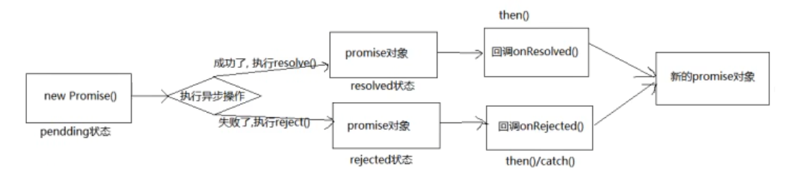

# Promise

## 00-教程简介

视频教程:尚硅谷 Web 前端 Promise 教程从入门到精通

视频地址:https://www.bilibili.com/video/BV1GA411x7z1?spm_id_from=333.337.search-card.all.click&vd_source=6e9c2de5b89c2ba4e13469e295319397

视频作者:尚硅谷-李强

## 01-Promise介绍与基本使用

### 01-Promise是什么

1. 抽象表达:

   - Promise 是一门新的技术(ES6 规范)

   - Promise 是 JS 中进行异步编程的新解决方案

     1. fs 文件操作

        ```js
        require("fs").readFile(",/index.html", (err, data) => {});
        ```

     2. 数据库操作

     3. Ajax

        ```js
        $.get("/server", (data) => {});
        ```

     4. 定时器

        ```js
        setTimeout(() => {}, 1000);
        ```

2. 具体表达:

   - 从语法上说:Promise是一个构造函数
   - 从功能上说:Promise对象用来封装一个异步操作并可以获取其成功或者失败的结果值

### 02-为什么需要Promise

1. 指定回调函数的方式更加灵活

   - 以往的回调函数实现异步操作,必须在启动异步任务前指定
   - Promise启动异步任务=>返回Promise对象=>给Promise对象绑定回调函数(绳子可以再异步任务结束后指定一个或多个回调函数)

2. 支持练市调用,可以解决回调地狱问题

   - 什么事回调地狱

     ```js
     asyncFunc1(opt, (...args) => {
       asyncFunc2(opt, (...args) => {
         asyncFunc3(opt, (...args) => {
           asyncFunc4(opt, (...args) => {
             // some operation
           });
         });
       });
     });
     ```

   - 回调地狱的缺点

     - 不便于阅读
     - 不便于异常处理

   - 解决方案

     - Promise链式调用

### 03-Promise初体验

- Promise 是一个 ECMAScript 6 提供的类，目的是更加优雅地书写复杂的异步任务。
- 由于 Promise 是 ES6 新增加的，所以一些旧的浏览器并不支持，苹果的 Safari 10 和 Windows 的 Edge 14 版本以上浏览器才开始支持 ES6 特性。

#### 01-抽奖练习

```html
<!DOCTYPE html>
<html lang="en">
  <head>
    <meta charset="UTF-8" />
    <meta http-equiv="X-UA-Compatible" content="IE=edge" />
    <meta name="viewport" content="width=device-width, initial-scale=1.0" />
    <title>01_Promise初体验</title>
  </head>
  <body>
    <div>
      <h2 class="page-header">01_Promise初体验</h2>
      <button class="btn btn-primary" id="btn1">点击抽奖1</button>
      <button class="btn btn-primary" id="btn2">点击抽奖2</button>
    </div>
    <script>
      // Promise 是一个 ECMAScript 6 提供的类，目的是更加优雅地书写复杂的异步任务。
      // 由于 Promise 是 ES6 新增加的，所以一些旧的浏览器并不支持，苹果的 Safari 10 和 Windows 的 Edge 14 版本以上浏览器才开始支持 ES6 特性。

      // 随机生成从m到n之间的整数
      function rand(m, n) {
        return Math.ceil(Math.random() * (n - m + 1)) + m - 1;
      }
      const btn1 = document.querySelector("#btn1");
      const btn2 = document.querySelector("#btn2");

      // 30%中奖,1秒后出结果

      // 不使用Promise封装
      btn1.addEventListener("click", function () {
      	setTimeout(() => {
      		let n = rand(1, 100);
      		if (n <= 30) {
      			alert("恭喜中奖");
      		} else {
      			alert("没有中奖");
      		}
      	}, 1000);
      });

      // 用Promise封装
      btn2.addEventListener("click", function () {
        const p = new Promise((resolve, reject) => {
          setTimeout(() => {
            let n = rand(1, 100);
            if (n <= 30) {
              resolve(n);
            } else {
              reject(n);
            }
          }, 1000);
        });
        // 调用promise.then(),利用value,reason传值
        p.then(
          (value) => {
            alert("恭喜中奖,号码:" + value);
          },
          (reason) => {
            alert("没有中奖,号码:" + reason);
          }
        );
      });
    </script>
  </body>
</html>
```

#### 02-读取文件练习

```js
// 读取路径为"./resource/content.txt"的文件

// 引入fs
const fs = require("fs");
// 回调函数
fs.readFile("./resource/content.txt", (err, data) => {
  if (err) {
    throw err;
  }
  console.log(data.toString());
});

//用Promise封装
let p = new Promise((resolve, reject) => {
  fs.readFile("./resource/content.txt", (err, data) => {
    if (err) {
      reject(err);
    }
    resolve(data);
  });
});
p.then(
  (value) => {
    console.log(value.toString());
  },
  (reason) => {
    console.log(reason);
  }
);

```

#### 03-Ajax发送请求练习

```html
<!DOCTYPE html>
<html lang="en">
  <head>
    <meta charset="UTF-8" />
    <meta http-equiv="X-UA-Compatible" content="IE=edge" />
    <meta name="viewport" content="width=device-width, initial-scale=1.0" />
    <title>03_Promise实践练习_发送AJAX请求</title>
  </head>
  <body>
    <div class="container">
      <h2 class="page-header">03_Promise实践练习_发送AJAX请求</h2>
      <button class="btn btn-primary" id="btn1">点击发送AJAX请求,不使用Promise</button>
      <button class="btn btn-primary" id="btn2">点击发送AJAX请求,用Promise封装</button>
    </div>
    <script>
      const btn1 = document.querySelector("#btn1");
      const btn2 = document.querySelector("#btn2");

      // 不使用Promise
      btn1.addEventListener("click", () => {
        const xhr = new XMLHttpRequest();
        xhr.open("GET", "https://api.apiopen.top/getJoke");
        xhr.send();
        xhr.onreadystatechange = () => {
          if (xhr.readyState === 4) {
            if (xhr.status >= 200 && xhr.status < 300) {
              console.log(xhr.response);
            } else {
              console.log(xhr.status);
            }
          }
        };
      });

      // 用Promise封装
      btn2.addEventListener("click", () => {
        const p = new Promise((resolve, reject) => {
          const xhr = new XMLHttpRequest();
          xhr.open("GET", "https://api.apiopen.top/getJoke");
          xhr.send();
          xhr.onreadystatechange = () => {
            if (xhr.readyState === 4) {
              if (xhr.status >= 200 && xhr.status < 300) {
                resolve(xhr.response);
              } else {
                reject(xhr.status);
              }
            }
          };
        });
        p.then(
          (value) => {
            console.log(value);
          },
          (reason) => {
            console.log(reason);
          }
        );
      });
    </script>
  </body>
</html>
```

#### 04-封装Promise函数,读取文件

```js
// 用Promise封装一个读取文件的方法 myReadFile(path)
function myReadFile(path) {
  return new Promise((resolve, reject) => {
    const fs = require("fs");
    fs.readFile(path, (err, data) => {
      if (err) {
        reject(err);
      } else {
        resolve(data);
      }
    });
  });
}
//调用方法 myReadFile(path)
myReadFile("./resource/content.txt").then(
  (value) => {
    console.log(value.toString());
  },
  (reason) => {
    console.log(reason);
  }
);
```

#### 05-util.promisify函数

```js
// util模块中的promisify方法 util是nodejs中内置模块
// 引入util和fs
const util = require("util");
const fs = require("fs");
let myReadFile = util.promisify(fs.readFile);
myReadFile("./resource/content.txt").then(
  (value) => {
    console.log(value.toString());
  },
  (reason) => {
    console.log(reason);
  }
);
```

#### 06-用Promise封装Ajax请求

```html
<!DOCTYPE html>
<html lang="en">
  <head>
    <meta charset="UTF-8" />
    <meta http-equiv="X-UA-Compatible" content="IE=edge" />
    <meta name="viewport" content="width=device-width, initial-scale=1.0" />
    <title>06_Promise实践练习_发送AJAX请求封装</title>
  </head>
  <body>
    <div class="container">
      <h2 class="page-header">06_Promise实践练习_发送AJAX请求封装</h2>
      <button class="btn btn-primary" id="btn">点击发送AJAX请求</button>
    </div>
    <script>
      const btn = document.querySelector("#btn");
      // 封装发送AJAX请求的方法 sendAJAX(url)
      function sendAJAX(url) {
        return new Promise((resolve, reject) => {
          const xhr = new XMLHttpRequest();
          xhr.responseType = "json";
          xhr.open("GET", url);
          xhr.send();
          xhr.onreadystatechange = () => {
            if (xhr.readyState === 4) {
              if (xhr.status >= 200 && xhr.status < 300) {
                resolve(xhr.response);
              } else {
                reject(xhr.status);
              }
            }
          };
        });
      }
      btn.addEventListener("click", () => {
        // 调用发送AJAX请求的方法 sendAJAX(url)
        sendAJAX("https://api.apiopen.top/getJoke").then(
          (value) => {
            console.log(value);
          },
          (reason) => {
            console.log(reason + 2);
          }
        );
      });
    </script>
  </body>
</html>
```

## 02-Promise的属性

### 01-状态:[[PromiseState]]

1. Promise实例对象的一个属性[[PromiseState]]
   - 未决定的：padding
   - 成功：resolved / fullfilled
   - 失败：rejected
2. Promise一共有两种状态变化,只能改变一次：
   - 从pending变成resolved/fulfilled
   - 从pending变成reject

### 02-值:[[PromiseState]]

Promise有一个属性[[PromiseResult]],[[PromiseResult]]只能由resolve()/reject()方法修改

```html
<!DOCTYPE html>
<html lang="en">
  <head>
    <meta charset="UTF-8" />
    <meta http-equiv="X-UA-Compatible" content="IE=edge" />
    <meta name="viewport" content="width=device-width, initial-scale=1.0" />
    <title>07_PromiseState与PromiseResult</title>
  </head>
  <body>
    <script>
      const p0 = new Promise((resolve, reject) => {});
      console.log(p0); // [[PromiseState]]: "pending", [[PromiseResult]]: undefined

      var num = 0;
      // var num = 1;
      const p = new Promise((resolve, reject) => {
        if (num === 1) {
          resolve(num);
        } else {
          reject(num);
        }
      });
      p.then(
        (value) => {
          console.log(p); // var num = 1; [[PromiseState]]: "fulfilled", [[PromiseResult]]: 1
        },
        (reason) => {
          console.log(p); // var num = 0; [[PromiseState]]: "rejected", [[PromiseResult]]: 0
        }
      );
    </script>
  </body>
</html>

```

## 03-Promise的基本流程



## 04-Promise API

### 01-Promise构造函数

```js
var flag = false;
var executor = function (resolve, reject) {
if (flag) {
resolve("resolved");
} else {
reject("rejected");
}
console.log("同步调用1");
};
const p1 = new Promise(executor);
console.log("同步调用2");
```

### 02-Promise.prototype.then方法

(onResolved, onRejected)=>{}

```js
var onResolved = (value) => {
  console.log(value);
};
var onRejected = (reason) => {
  console.log(reason);
};
p1.then(onResolved, onRejected);
```

### 03-Promise.prototype.catch方法

catch方法调用reject()

```js
p1.catch((reason) => {
  console.log(reason + " catch");
});
```

### 04-Promise.resolve方法

```js
// 如果传入的参数为非Promise类型的对象,则返回结果为成功的Promise对象
var p20 = Promise.resolve("HelloPromise");
console.log(p20); // Promise {<fulfilled>: 'HelloPromise'}
// 如果传入的参数为Promise类型的对象,则返回结果由所传入的参数Promise的结果所决定
var p21 = Promise.resolve(
  new Promise((resolve, reject) => {
    resolve("resolved");
  })
);
console.log(p21); // Promise {<fulfilled>: 'resolved'}
var p22 = Promise.resolve(
new Promise((resolve, reject) => {
  	reject("rejected");
  })
);
console.log(p22); // Promise {<rejected>: 'rejected'}
```

### 05-Promise.reject方法

```js
// 如果传入的参数为非Promise类型的对象,则返回结果为失败的Promise对象
var p30 = Promise.reject("HelloPromise");
console.log(p30); // Promise {<rejected>: 'HelloPromise'}
// 如果传入的参数为Promise类型的对象,则返回结果为失败的Promise对象,其[[PromiseResult]]为所传入的参数Promise对象
var p31 = Promise.reject(
  new Promise((resolve, reject) => {
    resolve("resolved");
  })
);
console.log(p31); // {<rejected>: Promise}
var p32 = Promise.reject(
  new Promise((resolve, reject) => {
    reject("rejected");
  })
);
console.log(p32); // {<rejected>: Promise}
```

### 06-Promise.all方法

```js
// Promise数组中所有都成功,返回结果为成功的Promise
var p41 = Promise.resolve(
  new Promise((resolve, reject) => {
    resolve("p41");
  })
);
var p42 = Promise.resolve(
  new Promise((resolve, reject) => {
    resolve("p42");
  })
);
var p43 = Promise.resolve("p43");
var result41 = Promise.all([p41, p42, p43]);
console.log(result41); // [[PromiseState]]: "fulfilled", [[PromiseResult]]: Array(3):0: "p41" 1: "p42" 2: "p43"
// 否则返回第一个失败的Promise
var p44 = Promise.reject(
  new Promise((resolve, reject) => {
    resolve("p44");
  })
);
var p45 = Promise.resolve(
  new Promise((resolve, reject) => {
    resolve("p45");
  })
);
var p46 = Promise.reject("p46");
var result42 = Promise.all([p44, p45, p46]); // [[PromiseState]]: "rejected", [[PromiseResult]]: {Promise : [[PromiseState]]: "fulfilled", [[PromiseResult]]: "p44"}
console.log(result42);
```

### 07-Promise.race方法

```js
// 返回第一个改变状态的Promise
var p51 = Promise.resolve(
  new Promise((resolve, reject) => {
    resolve("p51");
  })
);
var p52 = Promise.resolve(
  new Promise((resolve, reject) => {
    resolve("p52");
  })
);
var p53 = Promise.resolve("p53");

var p54 = Promise.resolve(
  new Promise((resolve, reject) => {
    setTimeout(function () {
      resolve("p51");
    }, 1000);
  })
);
var result51 = Promise.race([p51, p52, p53]);
console.log(result51); // [[PromiseState]]: "fulfilled", [[PromiseResult]]: "p51"

var result52 = Promise.race([p52, p53, p54]);
console.log(result52); // [[PromiseState]]: "fulfilled", [[PromiseResult]]: "p52"
```

## 05-Promise关键问题

### 01-改变PromiseState的三种方法:resolve/reject/throw

```js
var p = new Promise((resolve, reject) => {
  resolve("resolved"); // pending => fulfilled/resolved
  // reject("rejected"); // pending => rejected
  // throw "error"; // pending => rejected
});
console.log(p);
```

### 02-执行多个回调

```js
p.then((value) => {
  console.log(value + "回调一");
});
p.then((value) => {
  console.log(value + "回调二");
});
```

### 03-函数执行先后问题,先改变状态再执行回调

```js
var p1 = new Promise((resolve, reject) => {
  resolve("ok");
});
p1.then(
  (value) => {
    console.log(value + "回调");
  },
  (reason) => {}
);
```

### 04-then方法返回的结果,由then方法中回调函数返回的结果所决定

```js
var p2 = new Promise((resolve, reject) => {
  // resolve("resolved");
  reject("rejected");
});
var result = p2.then(
  (value) => {
    // return "p2ok";
    return new Promise((resolve, reject) => {
      resolve("p2_promise");
    });
  },
  (reason) => {
    return "failed";
  }
);
console.log(result);
```

### 05-串联多个任务

```js
var p3 = new Promise((resolve, reject) => {
  setTimeout(() => {
    resolve("resolved");
  }, 1000);
});
p3.then((value) => {
  console.log(value);
})
  .then((value) => {
  console.log(value);
})
  .then((value) => {
  console.log(value);
});
```

### 06-异常穿透

```js
var p4 = new Promise((resolve, reject) => {
  setTimeout(() => {
    resolve("resolved");
  }, 1000);
});
p4.then((value) => {
  console.log(value);
  throw "error"; // 此处抛出异常
})
  .then((value) => {
  console.log(value);
})
  .then((value) => {
  console.log(value);
})
  .catch((reason) => {
  console.log(reason + " catch");
});
```

### 07-中断Promise链

```js
var p5 = new Promise((resolve, reject) => {
  setTimeout(() => {
    resolve("resolved");
  }, 1000);
});
p5.then((value) => {
  console.log("回调1");
})
  .then((value) => {
  console.log("回调2");
  return new Promise(() => {}); // 此处return一个pending状态的Promise中断Promise链
})
  .then((value) => {
  console.log("回调3");
})
  .catch((reason) => {
  console.log(reason + " catch");
});
```


