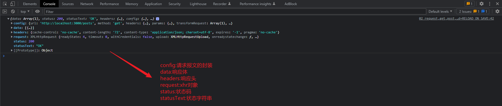

# Axios

## 00_教程简介

视频教程:尚硅谷Web前端axios入门与源码解析

视频地址:https://www.bilibili.com/video/BV1wr4y1K7tq/?spm_id_from=333.337.search-card.all.click&vd_source=6e9c2de5b89c2ba4e13469e295319397

视频作者-尚硅谷-李强

## 01_搭建服务端json-server

jsonp-server官网:https://www.npmjs.com/package/json-server

Install JSON Server

```bash
npm install -g json-server
```

Create a `db.json` file with some data

```json
{
  "posts": [
    {
      "id": 1,
      "title": "json-server",
      "author": "typicode"
    }
  ],
  "comments": [
    {
      "id": 1,
      "body": "some comment",
      "postId": 1
    }
  ],
  "profile": {
    "name": "typicode"
  }
}
```

Start JSON Server

```bash
json-server --watch db.json
```

## 02_认识axios

axios官网:https://www.npmjs.com/package/axios

axios中文:https://www.axios-http.cn

### 01_axios的基本使用

```html
<!DOCTYPE html>
<html lang="en">
  <head>
    <meta charset="UTF-8" />
    <meta
      name="viewport"
      content="width=device-width, user-scalable=no, initial-scale=1.0, maximum-scale=1.0, minimum-scale=1.0"
    />
    <meta http-equiv="X-UA-Compatible" content="ie=edge" />
    <title>01_axios的基本使用</title>
    <!-- 最新版本的 Bootstrap 核心 CSS 文件 -->
    <link
      rel="stylesheet"
      href="https://stackpath.bootstrapcdn.com/bootstrap/3.4.1/css/bootstrap.min.css"
      integrity="sha384-HSMxcRTRxnN+Bdg0JdbxYKrThecOKuH5zCYotlSAcp1+c8xmyTe9GYg1l9a69psu"
      crossorigin="anonymous"
    />
    <script src="https://cdn.bootcdn.net/ajax/libs/axios/0.21.1/axios.min.js"></script>
  </head>
  <body>
    <div class="container">
      <h2 class="page-header">axios</h2>
      <button type="button" class="btn btn-primary">GET</button>
      <button type="button" class="btn btn-secondary">POST</button>
      <button type="button" class="btn btn-success">PUT</button>
      <button type="button" class="btn btn-danger">DELETE</button>
      <div id="result"></div>
    </div>
    <script>
      const btns = document.querySelectorAll("button");
      const result = document.getElementById("result");
      btns[0].addEventListener("click", function () {
        axios({
          method: "GET",
          url: "http://localhost:3000/posts",
          params: {
            id: 1,
          },
        }).then((response) => {
          console.log(response);
        });
      });

      btns[1].addEventListener("click", function () {
        axios({
          method: "POST",
          url: "http://localhost:3000/posts",
          data: {
            id: 3,
            title: "handsome guy",
            name: "Alex",
          },
        }).then((response) => {
          console.log(response);
        });
      });

      btns[2].addEventListener("click", function () {
        axios({
          method: "PUT",
          url: "http://localhost:3000/posts/3",
          data: {
            title: "handsome guy",
            name: "AAA",
          },
        }).then((response) => {
          console.log(response);
        });
      });

      btns[3].addEventListener("click", function () {
        axios({
          method: "DELETE",
          url: "http://localhost:3000/posts/2",
        }).then((response) => {
          console.log(response);
        });
      });
    </script>
  </body>
</html>
```

### 02_request,get,post,put,delete等方法

```html
<!DOCTYPE html>
<html lang="en">
  <head>
    <meta charset="UTF-8" />
    <meta
      name="viewport"
      content="width=device-width, user-scalable=no, initial-scale=1.0, maximum-scale=1.0, minimum-scale=1.0"
    />
    <meta http-equiv="X-UA-Compatible" content="ie=edge" />
    <title>02_request,get,post,put,delete等方法</title>
    <!-- 最新版本的 Bootstrap 核心 CSS 文件 -->
    <link
      rel="stylesheet"
      href="https://stackpath.bootstrapcdn.com/bootstrap/3.4.1/css/bootstrap.min.css"
      integrity="sha384-HSMxcRTRxnN+Bdg0JdbxYKrThecOKuH5zCYotlSAcp1+c8xmyTe9GYg1l9a69psu"
      crossorigin="anonymous"
    />
    <script src="https://cdn.bootcdn.net/ajax/libs/axios/0.21.1/axios.min.js"></script>
  </head>
  <body>
    <div class="container">
      <h2 class="page-header">axios</h2>
      <button type="button" class="btn btn-primary">GET</button>
      <button type="button" class="btn btn-secondary">POST</button>
      <button type="button" class="btn btn-success">PUT</button>
      <button type="button" class="btn btn-danger">DELETE</button>
      <div id="result"></div>
    </div>
    <script>
      const btns = document.querySelectorAll("button");
      const result = document.getElementById("result");
      btns[0].addEventListener("click", function () {
        axios
          .request({
            method: "GET",
            url: "http://localhost:3000/posts",
            params: {
              id: 1,
            },
          })
          .then((response) => {
            console.log(response);
          });
      });

      btns[1].addEventListener("click", function () {
        axios
          .post("http://localhost:3000/posts", {
            name: "aaa",
            value: "bbb",
          })
          .then((response) => {
            console.log(response);
          });
      });

      // 其他方法同理,此处省略
    </script>
  </body>
</html>
```

### 03_axios响应结果的结构



### 04_axios的Request Config(请求配置对象)

```json
{
  // `url` is the server URL that will be used for the request
  url: '/user',

  // `method` is the request method to be used when making the request
  method: 'get', // default

  // `baseURL` will be prepended to `url` unless `url` is absolute.
  // It can be convenient to set `baseURL` for an instance of axios to pass relative URLs
  // to methods of that instance.
  baseURL: 'https://some-domain.com/api/',

  // `transformRequest` allows changes to the request data before it is sent to the server
  // This is only applicable for request methods 'PUT', 'POST', 'PATCH' and 'DELETE'
  // The last function in the array must return a string or an instance of Buffer, ArrayBuffer,
  // FormData or Stream
  // You may modify the headers object.
  transformRequest: [function (data, headers) {
    // Do whatever you want to transform the data

    return data;
  }],

  // `transformResponse` allows changes to the response data to be made before
  // it is passed to then/catch
  transformResponse: [function (data) {
    // Do whatever you want to transform the data

    return data;
  }],

  // `headers` are custom headers to be sent
  headers: {'X-Requested-With': 'XMLHttpRequest'},

  // `params` are the URL parameters to be sent with the request
  // Must be a plain object or a URLSearchParams object
  params: {
    ID: 12345
  },

  // `paramsSerializer` is an optional config in charge of serializing `params`
  paramsSerializer: {
    encode?: (param: string): string => { /* Do custom ops here and return transformed string */ }, // custom encoder function; sends Key/Values in an iterative fashion
    serialize?: (params: Record<string, any>, options?: ParamsSerializerOptions ), // mimic pre 1.x behavior and send entire params object to a custom serializer func. Allows consumer to control how params are serialized.
    indexes: false // array indexes format (null - no brackets, false (default) - empty brackets, true - brackets with indexes)
  },

  // `data` is the data to be sent as the request body
  // Only applicable for request methods 'PUT', 'POST', 'DELETE , and 'PATCH'
  // When no `transformRequest` is set, must be of one of the following types:
  // - string, plain object, ArrayBuffer, ArrayBufferView, URLSearchParams
  // - Browser only: FormData, File, Blob
  // - Node only: Stream, Buffer, FormData (form-data package)
  data: {
    firstName: 'Fred'
  },

  // syntax alternative to send data into the body
  // method post
  // only the value is sent, not the key
  data: 'Country=Brasil&City=Belo Horizonte',

  // `timeout` specifies the number of milliseconds before the request times out.
  // If the request takes longer than `timeout`, the request will be aborted.
  timeout: 1000, // default is `0` (no timeout)

  // `withCredentials` indicates whether or not cross-site Access-Control requests
  // should be made using credentials
  withCredentials: false, // default

  // `adapter` allows custom handling of requests which makes testing easier.
  // Return a promise and supply a valid response (see lib/adapters/README.md).
  adapter: function (config) {
    /* ... */
  },

  // `auth` indicates that HTTP Basic auth should be used, and supplies credentials.
  // This will set an `Authorization` header, overwriting any existing
  // `Authorization` custom headers you have set using `headers`.
  // Please note that only HTTP Basic auth is configurable through this parameter.
  // For Bearer tokens and such, use `Authorization` custom headers instead.
  auth: {
    username: 'janedoe',
    password: 's00pers3cret'
  },

  // `responseType` indicates the type of data that the server will respond with
  // options are: 'arraybuffer', 'document', 'json', 'text', 'stream'
  //   browser only: 'blob'
  responseType: 'json', // default

  // `responseEncoding` indicates encoding to use for decoding responses (Node.js only)
  // Note: Ignored for `responseType` of 'stream' or client-side requests
  responseEncoding: 'utf8', // default

  // `xsrfCookieName` is the name of the cookie to use as a value for xsrf token
  xsrfCookieName: 'XSRF-TOKEN', // default

  // `xsrfHeaderName` is the name of the http header that carries the xsrf token value
  xsrfHeaderName: 'X-XSRF-TOKEN', // default

  // `onUploadProgress` allows handling of progress events for uploads
  // browser & node.js
  onUploadProgress: function ({loaded, total, progress, bytes, estimated, rate, upload = true}) {
    // Do whatever you want with the Axios progress event
  },

  // `onDownloadProgress` allows handling of progress events for downloads
  // browser & node.js
  onDownloadProgress: function ({loaded, total, progress, bytes, estimated, rate, download = true}) {
    // Do whatever you want with the Axios progress event
  },

  // `maxContentLength` defines the max size of the http response content in bytes allowed in node.js
  maxContentLength: 2000,

  // `maxBodyLength` (Node only option) defines the max size of the http request content in bytes allowed
  maxBodyLength: 2000,

  // `validateStatus` defines whether to resolve or reject the promise for a given
  // HTTP response status code. If `validateStatus` returns `true` (or is set to `null`
  // or `undefined`), the promise will be resolved; otherwise, the promise will be
  // rejected.
  validateStatus: function (status) {
    return status >= 200 && status < 300; // default
  },

  // `maxRedirects` defines the maximum number of redirects to follow in node.js.
  // If set to 0, no redirects will be followed.
  maxRedirects: 21, // default

  // `beforeRedirect` defines a function that will be called before redirect.
  // Use this to adjust the request options upon redirecting,
  // to inspect the latest response headers,
  // or to cancel the request by throwing an error
  // If maxRedirects is set to 0, `beforeRedirect` is not used.
  beforeRedirect: (options, { headers }) => {
    if (options.hostname === "example.com") {
      options.auth = "user:password";
    }
  },

  // `socketPath` defines a UNIX Socket to be used in node.js.
  // e.g. '/var/run/docker.sock' to send requests to the docker daemon.
  // Only either `socketPath` or `proxy` can be specified.
  // If both are specified, `socketPath` is used.
  socketPath: null, // default
  
  // `transport` determines the transport method that will be used to make the request. If defined, it will be used. Otherwise, if `maxRedirects` is 0, the default `http` or `https` library will be used, depending on the protocol specified in `protocol`. Otherwise, the `httpFollow` or `httpsFollow` library will be used, again depending on the protocol, which can handle redirects.
  transport: undefined, // default

  // `httpAgent` and `httpsAgent` define a custom agent to be used when performing http
  // and https requests, respectively, in node.js. This allows options to be added like
  // `keepAlive` that are not enabled by default.
  httpAgent: new http.Agent({ keepAlive: true }),
  httpsAgent: new https.Agent({ keepAlive: true }),

  // `proxy` defines the hostname, port, and protocol of the proxy server.
  // You can also define your proxy using the conventional `http_proxy` and
  // `https_proxy` environment variables. If you are using environment variables
  // for your proxy configuration, you can also define a `no_proxy` environment
  // variable as a comma-separated list of domains that should not be proxied.
  // Use `false` to disable proxies, ignoring environment variables.
  // `auth` indicates that HTTP Basic auth should be used to connect to the proxy, and
  // supplies credentials.
  // This will set an `Proxy-Authorization` header, overwriting any existing
  // `Proxy-Authorization` custom headers you have set using `headers`.
  // If the proxy server uses HTTPS, then you must set the protocol to `https`.
  proxy: {
    protocol: 'https',
    host: '127.0.0.1',
    // hostname: '127.0.0.1' // Takes precedence over 'host' if both are defined
    port: 9000,
    auth: {
      username: 'mikeymike',
      password: 'rapunz3l'
    }
  },

  // `cancelToken` specifies a cancel token that can be used to cancel the request
  // (see Cancellation section below for details)
  cancelToken: new CancelToken(function (cancel) {
  }),

  // an alternative way to cancel Axios requests using AbortController
  signal: new AbortController().signal,

  // `decompress` indicates whether or not the response body should be decompressed
  // automatically. If set to `true` will also remove the 'content-encoding' header
  // from the responses objects of all decompressed responses
  // - Node only (XHR cannot turn off decompression)
  decompress: true // default

  // `insecureHTTPParser` boolean.
  // Indicates where to use an insecure HTTP parser that accepts invalid HTTP headers.
  // This may allow interoperability with non-conformant HTTP implementations.
  // Using the insecure parser should be avoided.
  // see options https://nodejs.org/dist/latest-v12.x/docs/api/http.html#http_http_request_url_options_callback
  // see also https://nodejs.org/en/blog/vulnerability/february-2020-security-releases/#strict-http-header-parsing-none
  insecureHTTPParser: undefined // default

  // transitional options for backward compatibility that may be removed in the newer versions
  transitional: {
    // silent JSON parsing mode
    // `true`  - ignore JSON parsing errors and set response.data to null if parsing failed (old behaviour)
    // `false` - throw SyntaxError if JSON parsing failed (Note: responseType must be set to 'json')
    silentJSONParsing: true, // default value for the current Axios version

    // try to parse the response string as JSON even if `responseType` is not 'json'
    forcedJSONParsing: true,

    // throw ETIMEDOUT error instead of generic ECONNABORTED on request timeouts
    clarifyTimeoutError: false,
  },

  env: {
    // The FormData class to be used to automatically serialize the payload into a FormData object
    FormData: window?.FormData || global?.FormData
  },

  formSerializer: {
      visitor: (value, key, path, helpers) => {}; // custom visitor function to serialize form values
      dots: boolean; // use dots instead of brackets format
      metaTokens: boolean; // keep special endings like {} in parameter key
      indexes: boolean; // array indexes format null - no brackets, false - empty brackets, true - brackets with indexes
  },

  // http adapter only (node.js)
  maxRate: [
    100 * 1024, // 100KB/s upload limit,
    100 * 1024  // 100KB/s download limit
  ]
}
```

### 05_axios.defaults默认配置

默认配置用于那些重复的代码

```js
axios.defaults.method = "GET";
axios.defaults.baseURL = "http://localhost:3000";
axios.defaults.timeout = 2000;
```

### 06_axios.create创建实例对象

- axios.create创建实例对象与axios的功能几乎完全一样

```html
<!DOCTYPE html>
<html lang="en">
  <head>
    <meta charset="UTF-8" />
    <meta
      name="viewport"
      content="width=device-width, user-scalable=no, initial-scale=1.0, maximum-scale=1.0, minimum-scale=1.0"
    />
    <meta http-equiv="X-UA-Compatible" content="ie=edge" />
    <title>06_axios.create创建实例对象</title>
    <!-- 最新版本的 Bootstrap 核心 CSS 文件 -->
    <link
      rel="stylesheet"
      href="https://stackpath.bootstrapcdn.com/bootstrap/3.4.1/css/bootstrap.min.css"
      integrity="sha384-HSMxcRTRxnN+Bdg0JdbxYKrThecOKuH5zCYotlSAcp1+c8xmyTe9GYg1l9a69psu"
      crossorigin="anonymous"
    />
    <script src="https://cdn.bootcdn.net/ajax/libs/axios/0.21.1/axios.min.js"></script>
  </head>
  <body>
    <div class="container">
      <h2 class="page-header">axios</h2>
      <button type="button" class="btn btn-primary">GET</button>
      <button type="button" class="btn btn-secondary">POST</button>
      <button type="button" class="btn btn-success">PUT</button>
      <button type="button" class="btn btn-danger">DELETE</button>
      <div id="result"></div>
    </div>
    <script>
      const http = axios.create({
        baseURL: "http://localhost:3000",
        timeout: 2000,
      });

      const btns = document.querySelectorAll("button");
      const result = document.getElementById("result");
      btns[0].addEventListener("click", function () {
        http({
          method: "GET",
          url: "/posts",
          params: {
            id: 1,
          },
        }).then((response) => {
          console.log(response);
        });
      });

      btns[1].addEventListener("click", function () {
        http
          .post("/posts", {
            name: "Ronaldo",
            country: "Brazil",
          })
          .then((response) => {
            console.log(response);
          });
      });
    </script>
  </body>
</html>
```

### 07_拦截器

```html
<!DOCTYPE html>
<html lang="en">
  <head>
    <meta charset="UTF-8" />
    <meta
      name="viewport"
      content="width=device-width, user-scalable=no, initial-scale=1.0, maximum-scale=1.0, minimum-scale=1.0"
    />
    <meta http-equiv="X-UA-Compatible" content="ie=edge" />
    <title>07_拦截器</title>
    <!-- 最新版本的 Bootstrap 核心 CSS 文件 -->
    <link
      rel="stylesheet"
      href="https://stackpath.bootstrapcdn.com/bootstrap/3.4.1/css/bootstrap.min.css"
      integrity="sha384-HSMxcRTRxnN+Bdg0JdbxYKrThecOKuH5zCYotlSAcp1+c8xmyTe9GYg1l9a69psu"
      crossorigin="anonymous"
    />
    <script src="https://cdn.bootcdn.net/ajax/libs/axios/0.21.1/axios.min.js"></script>
  </head>
  <body>
    <div class="container">
      <h2 class="page-header">axios</h2>
      <button type="button" class="btn btn-primary">GET</button>
      <button type="button" class="btn btn-secondary">POST</button>
      <button type="button" class="btn btn-success">PUT</button>
      <button type="button" class="btn btn-danger">DELETE</button>
      <div id="result"></div>
    </div>
    <script>
      const http = axios.create({
        baseURL: "http://localhost:3000",
        timeout: 2000,
      });

      http.interceptors.request.use(
        function (config) {
          console.log("请求拦截器1成功");
          return config;
        },
        function (error) {
          console.log("请求拦截器1失败");
          return Promise.reject(error);
        }
      );

      http.interceptors.request.use(
          function (config) {
            console.log("请求拦截器2成功");
            return config;
          },
          function (error) {
            console.log("请求拦截器2失败");
            return Promise.reject(error);
          }
      );

      http.interceptors.response.use(
        function (response) {
          console.log("响应拦截器1成功");
          return response;
        },
        function (error) {
          console.log("响应拦截器1失败");
          return Promise.reject(error);
        }
      );

      http.interceptors.response.use(
          function (response) {
            console.log("响应拦截器2成功");
            return response;
          },
          function (error) {
            console.log("响应拦截器2失败");
            return Promise.reject(error);
          }
      );

      const btns = document.querySelectorAll("button");
      const result = document.getElementById("result");
      btns[0].addEventListener("click", function () {
        http({
          method: "GET",
          url: "/posts",
          params: {
            id: 1,
          },
        }).then((response) => {
          console.log(response);
        });
      });

      btns[1].addEventListener("click", function () {
        http
          .post("/posts", {
            name: "Ronaldo",
            country: "Brazil",
          })
          .then((response) => {
            console.log(response);
          });
      });
    </script>
  </body>
</html>
```


### 08_取消请求

```html
<!DOCTYPE html>
<html lang="en">
  <head>
    <meta charset="UTF-8" />
    <meta
      name="viewport"
      content="width=device-width, user-scalable=no, initial-scale=1.0, maximum-scale=1.0, minimum-scale=1.0"
    />
    <meta http-equiv="X-UA-Compatible" content="ie=edge" />
    <title>08_取消请求</title>
    <!-- 最新版本的 Bootstrap 核心 CSS 文件 -->
    <link
      rel="stylesheet"
      href="https://stackpath.bootstrapcdn.com/bootstrap/3.4.1/css/bootstrap.min.css"
      integrity="sha384-HSMxcRTRxnN+Bdg0JdbxYKrThecOKuH5zCYotlSAcp1+c8xmyTe9GYg1l9a69psu"
      crossorigin="anonymous"
    />
    <script src="https://cdn.bootcdn.net/ajax/libs/axios/0.21.1/axios.min.js"></script>
  </head>
  <body>
    <div class="container">
      <h2 class="page-header">axios</h2>
      <button type="button" class="btn btn-primary">发送请求</button>
      <button type="button" class="btn btn-secondary">取消请求</button>
      <div id="result"></div>
    </div>
    <script>
      const http = axios.create({
        baseURL: "http://localhost:3000",
        timeout: 3000,
      });

      const btns = document.querySelectorAll("button");
      const result = document.getElementById("result");

      let cancel = null;
      btns[0].addEventListener("click", function () {
        if (cancel) {
          cancel();
        }
        http({
          method: "GET",
          url: "/posts",
          params: {
            id: 1,
          },
          cancelToken: new axios.CancelToken(function (c) {
            cancel = c;
          }),
        }).then((response) => {
          console.log(response);
          cancel = null;
        });
      });

      btns[1].addEventListener("click", function () {
        cancel();
      });
    </script>
  </body>
</html>
```

## 03_axios源码分析(以后有时间再学习)