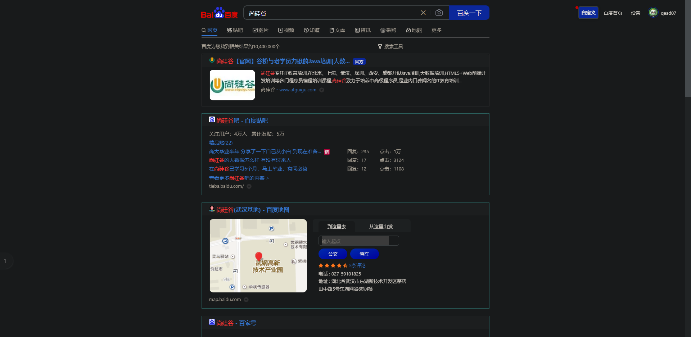
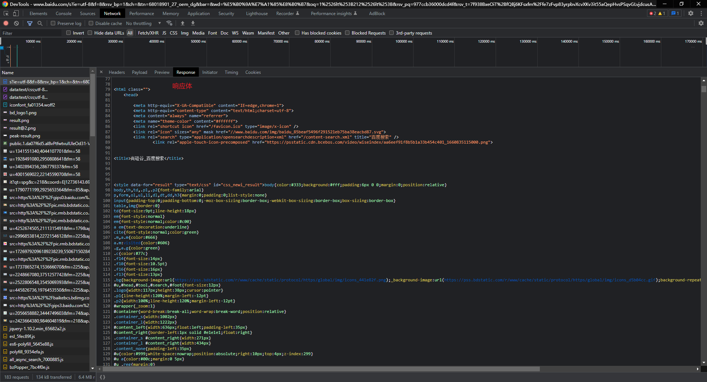
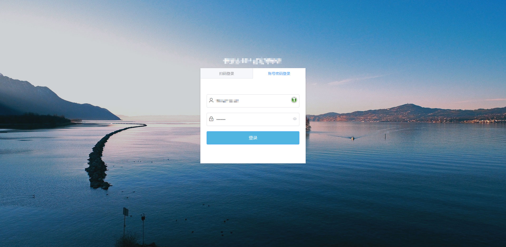
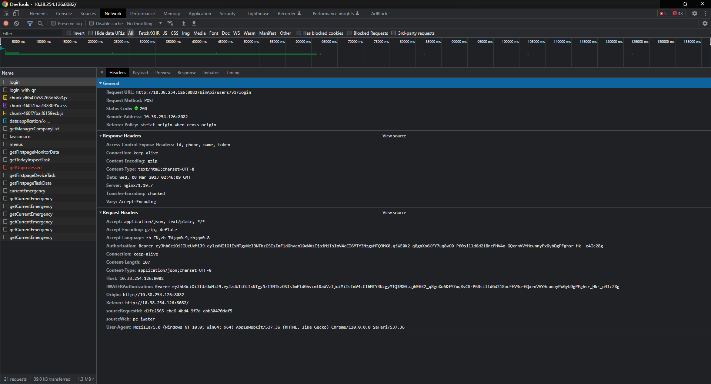
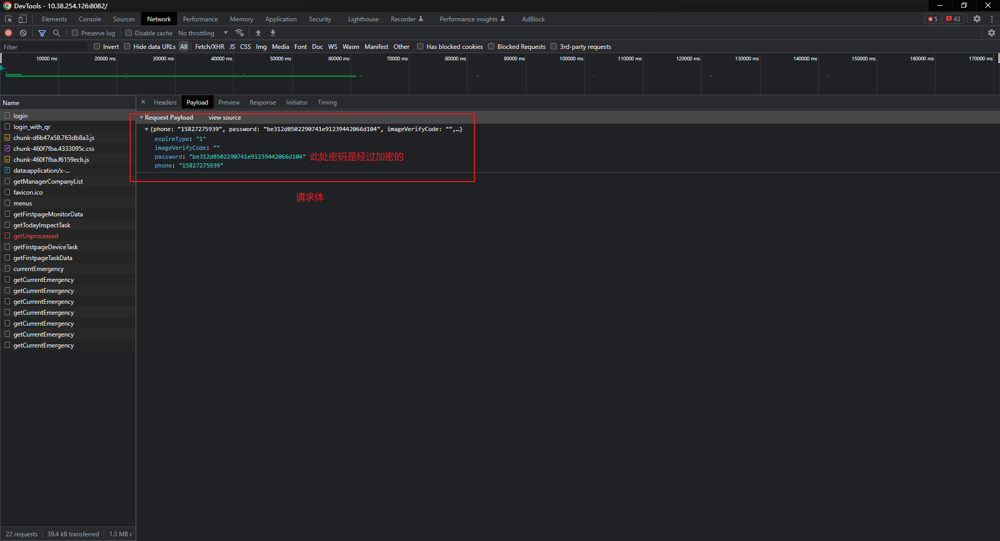
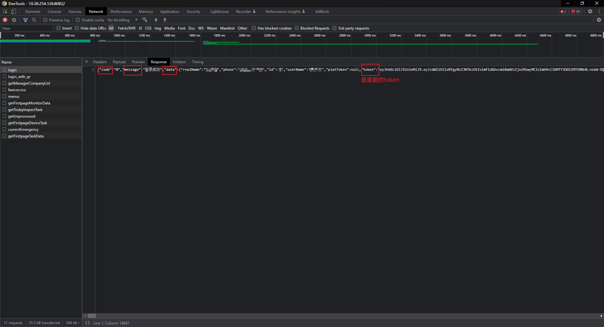
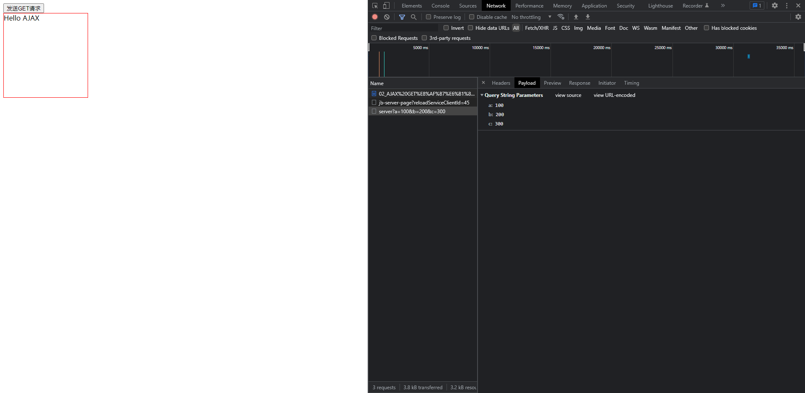
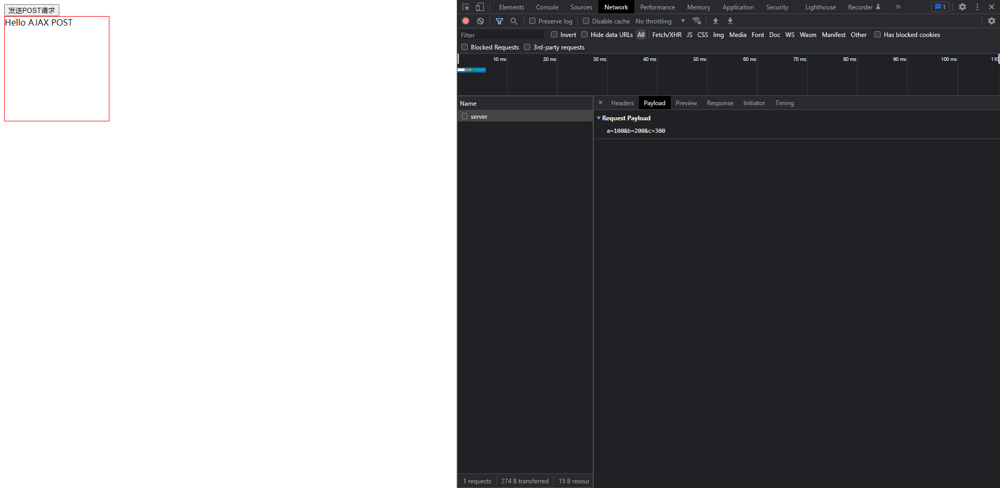

# AJAX

## 00_教程简介

视频教程:【尚硅谷】3小时Ajax入门到精通

视频地址:https://www.bilibili.com/video/BV1WC4y1b78y?p=1&vd_source=6e9c2de5b89c2ba4e13469e295319397

视频作者:尚硅谷-李强

## 01_AJAX基础知识

### 01_AJAX简介

AJAX全称为**Asynchronous JavaScript And XML**,就是异步的JS和XML.

通过AJAX可以再浏览器想服务器发送异步请求,最大的优势就是无刷新的获取数据.

AJAX不是新的编程语言,而是一种将现有的标准组合在一起使用的新方式.

### 02_XML简介

XML可拓展标记语言,被设计用来传输和存储数据

XML和HTML类似,不同的是HTML中都是预定义的标签,而XML中没有预定义标签,全都是自定义标签,用来标识一些数据.

- 用JS表示一个学生数据

```js
let student = {
  name: "张三",
  age: 18,
  gender: "男",
};
```

- 用XML表示一个学生数据

```xml
<student>
  <name>张三</name>
  <age>18</age>
  <gender>男</gender>
</student>
```

- 现在已经被JSON取代了,用JSON表示一个学生数据

```json
{
  "name":"张三",
  ""age":"18"
  "gender"":"男"
}
```

### 03_AJAX的特点

1. AJAX的优点
   - 可以无需刷新页面而与服务器进行通信
   - 允许你根据用户事件来更新部分页面内容
2. AJAX的缺点
   - 没有浏览历史,不能回退
   - 存在跨域问题(同源)
   - SEO不友好

## 02_HTTP协议

HTTP(Hypertext Transport Protocol)协议[[超文本传输协议]],协议详细规定了浏览器和万维网服务器之间通信的规则

### 01_请求报文

重点介绍格式与参数

GET方法没有请求体

POST方法一般有请求体

```http
请求行:method url 协议版本
	POST /s?ie=uft-8 HTTP/1.1 
请求头
  Host: atguigu.com
  Cookie: name=guigu
  Content-type: application/x-www-form-urlencoded
空行
请求体
	username=admin$password=admin
```

### 02_响应报文

```http
响应行:协议版本 响应状态码 响应状态字符串
	HTTP/1.1 200 OK
响应头
  Content-type: text/html;chartset=utf-8
  Content-length: 2048
  Content-encoding: g-zip
空行
响应体
  <html lang="en">
    <head>
      <meta charset="UTF-8" />
      <title>Title</title>
    </head>
    <body>
      <script>
        let test = {
          name: "张三",
          age: 18,
          gender: "男",
        };
      </script>
      <student>
        <name>张三</name>
        <age>18</age>
        <gender>男</gender>
      </student>
    </body>
  </html>
```

### 03_Chrome查看http报文

1. GET请求

百度搜索栏输入"尚硅谷"敲击回车 => F12打开控制台 => Network选项卡






2. POST请求

公司内部后台管理项目登录页面,登录操作发送POST请求







## 03_AJAX知识

### 00_Express服务端

Express服务端:基于Node.js平台的web应用开发框架

```js
// 引入express
const express = require("express");

// 创建express对象
const app = express();

// 创建路由规则
// request是请求报文的封装
// response是响应报文的封装

// get
app.get("/server", (request, response) => {
  // 设置响应头
  response.setHeader("Access-Control-Allow-Origin", "*"); // 允许跨域

  // 设置响应体
  response.send("Hello AJAX");
});

// post
app.post("/server", (request, response) => {
  // 设置响应头
  response.setHeader("Access-Control-Allow-Origin", "*"); // 允许跨域

  // 设置响应体
  response.send("Hello AJAX POST");
});

// all
app.all("/json-server", (request, response) => {
  // 设置响应头
  response.setHeader("Access-Control-Allow-Origin", "*"); // 允许跨域
  const data = { name: "Alex" };
  let str = JSON.stringify(data);
  // 设置响应体
  response.send(str);
});

// 监听端口启动服务
const port = 8000;
app.listen(port, () => {
  console.log(`服务已启动,${port}端口正在监听中...`);
});
```

### 01_客户端发送GET请求

```html
<!DOCTYPE html>
<html lang="en">
  <head>
    <meta charset="UTF-8" />
    <meta
      name="viewport"
      content="width=device-width, user-scalable=no, initial-scale=1.0, maximum-scale=1.0, minimum-scale=1.0"
    />
    <meta http-equiv="X-UA-Compatible" content="ie=edge" />
    <title>Document</title>
    <style>
      #result {
        width: 200px;
        height: 200px;
        border: 1px red solid;
      }
    </style>
  </head>
  <body>
    <button id="btn">发送GET请求</button>
    <div id="result"></div>
    <script>
      const btn = document.getElementById("btn");
      const result = document.getElementById("result");
      window.addEventListener("click", () => {
        // 创建xhr对象
        const xhr = new XMLHttpRequest();
        // 设置请求方法和url
        xhr.open("GET", "http://127.0.0.1:8000/server?a=100&b=200&c=300"); // 传query
        // 发送请求
        xhr.send();
        // 事件绑定 处理服务端返回的结果
        xhr.onreadystatechange = () => {
          // readystate的状态码有:
          // 0: 未初始化
          // 1: open方法调用完毕
          // 2: send方法调用完毕
          // 3: 服务端返回部分结果
          // 4: 服务端返回所有结果完毕
          if (xhr.readyState === 4) {
            // status 状态码有 200(OK) 404 403 401 500等,其中200到300都是成功
            if (xhr.status >= 200 && xhr.status <= 300) {
              console.log(xhr.status); // 状态码
              console.log(xhr.statusText); // 状态字符串
              console.log(xhr.getAllResponseHeaders()); // 所有响应头
              console.log(xhr.response); // 响应体
              result.innerHTML = xhr.response;
            }
          }
        };
      });
    </script>
  </body>
</html>
```

运行结果




### 02_客户端发送POST请求

```html
<!DOCTYPE html>
<html lang="en">
  <head>
    <meta charset="UTF-8" />
    <meta
      name="viewport"
      content="width=device-width, user-scalable=no, initial-scale=1.0, maximum-scale=1.0, minimum-scale=1.0"
    />
    <meta http-equiv="X-UA-Compatible" content="ie=edge" />
    <title>Document</title>
    <style>
      #result {
        width: 200px;
        height: 200px;
        border: 1px red solid;
      }
    </style>
  </head>
  <body>
    <button id="btn">发送POST请求</button>
    <div id="result"></div>
    <script>
      const btn = document.getElementById("btn");
      const result = document.getElementById("result");
      window.addEventListener("click", () => {
        // 创建xhr对象
        const xhr = new XMLHttpRequest();
        // 设置请求方法和url
        xhr.open("POST", "http://127.0.0.1:8000/server");
        // 发送请求
        xhr.send("a=100&b=200&c=300"); // 设置请求体
        // 事件绑定 处理服务端返回的结果
        xhr.onreadystatechange = () => {
          // readystate的状态码有:
          // 0: 未初始化
          // 1: open方法调用完毕
          // 2: send方法调用完毕
          // 3: 服务端返回部分结果
          // 4: 服务端返回所有结果完毕
          if (xhr.readyState === 4) {
            // status 状态码有 200(OK) 404 403 401 500等,其中200到300都是成功
            if (xhr.status >= 200 && xhr.status <= 300) {
              console.log(xhr.status); // 状态码
              console.log(xhr.statusText); // 状态字符串
              console.log(xhr.getAllResponseHeaders()); // 所有响应头
              console.log(xhr.response); // 响应体
              result.innerHTML = xhr.response;
            }
          }
        };
      });
    </script>
  </body>
</html>
```

运行结果




- 设置请求头

```js
// 设置请求头
xhr.setRequestHeader(
  "Content-Type",
  "application/x-www-form-urlencoded"
);
```

### 03_服务器处理JSON数据

```html
<!DOCTYPE html>
<html lang="en">
  <head>
    <meta charset="UTF-8" />
    <meta
      name="viewport"
      content="width=device-width, user-scalable=no, initial-scale=1.0, maximum-scale=1.0, minimum-scale=1.0"
    />
    <meta http-equiv="X-UA-Compatible" content="ie=edge" />
    <title>Document</title>
    <style>
      #result {
        width: 200px;
        height: 200px;
        border: 1px red solid;
      }
    </style>
  </head>
  <body>
    <button id="btn">发送POST请求</button>
    <div id="result"></div>
    <script>
      const btn = document.getElementById("btn");
      const result = document.getElementById("result");
      window.addEventListener("click", () => {
        // 创建xhr对象
        const xhr = new XMLHttpRequest();
        // 设置请求方法和url
        xhr.open("POST", "http://127.0.0.1:8000/json-server");

        // 设置请求头
        xhr.setRequestHeader(
          "Content-Type",
          "application/x-www-form-urlencoded"
        );

        // 发送请求
        xhr.send("a=100&b=200&c=300"); // 设置请求体
        // 事件绑定 处理服务端返回的结果
        xhr.onreadystatechange = () => {
          // readystate的状态码有:
          // 0: 未初始化
          // 1: open方法调用完毕
          // 2: send方法调用完毕
          // 3: 服务端返回部分结果
          // 4: 服务端返回所有结果完毕
          if (xhr.readyState === 4) {
            // status 状态码有 200(OK) 404 403 401 500等,其中200到300都是成功
            if (xhr.status >= 200 && xhr.status <= 300) {
              console.log(xhr.status); // 状态码
              console.log(xhr.statusText); // 状态字符串
              console.log(xhr.getAllResponseHeaders()); // 所有响应头
              console.log(xhr.response); // 响应体
              result.innerHTML = xhr.response;
              result.innerHTML = JSON.parse(xhr.response).name;
            }
          }
        };
      });
    </script>
  </body>
</html>
```

运行结果


### 04_客户端请求超时与异常处理

- 服务端

```js
setTimeout(() => {
  // 设置响应体
  response.send(str);
}, 3000); // 设置3秒后返回结果
```

- 客户端

```js
xhr.timeout = 2000; // 2秒后没收到结果,取消请求

xhr.ontimeout = () => {
  alert("请求超时");
};

xhr.onerror = () => {
  alert("网络异常");
};
```

### 05_手动取消请求

- 客户端

```js
xhr.abort()
```

### 06_防止重复请求

- 客户端

```js
let xhr = new XMLHttpRequest();
let isSending = true;
window.addEventListener("click", () => {
  isSending = true;
  // 创建xhr对象
  if (isSending) {
    xhr.abort();
  }
  xhr = new XMLHttpRequest();
  // 设置请求方法和url
  xhr.open("POST", "http://127.0.0.1:8000/json-server");

  // 设置请求头
  xhr.setRequestHeader(
    "Content-Type",
    "application/x-www-form-urlencoded"
  );


  if (isSending) {
    xhr.abort();
  }
  // 发送请求
  xhr.send("a=100&b=200&c=300"); // 设置请求体
  // 事件绑定 处理服务端返回的结果
  xhr.onreadystatechange = () => {

    if (xhr.readyState === 4) {
      isSending = false;
      if (xhr.status >= 200 && xhr.status <= 300) {
        result.innerHTML = JSON.parse(xhr.response).name;
      }
    }
  };
});
```

### 06_JQuery发送AJAX请求(略)

### 07_Axios发送AJAX请求(略)

### 08_fetch函数发送AJAX请求

```js
window.addEventListener("click", () => {
  fetch("http://127.0.0.1:8000/json-server", {
    method: "POST",
    // headers: {
    //   name: "Alex",
    // },
    body: {
      username: "AlexDGP",
      password: "12345678",
    },
  })
    .then((response) => {
      return response.text();
    })
    .then((response) => {
      console.log(response);
    });
});
```

### 09_同源策略

AJAX默认支持同源策略

同源策略(Same-Origin Policy)最早由Netscape公司提出,是浏览器的一种安全策略.

同源:协议,域名,端口号 必须完全相同

违背同源策略就是跨域

- 服务器

```js
app.get("/home", (req, res) => {
  res.sendFile(__dirname + "/index.html");
});

app.get("/data", (req, res) => {
  res.send("用户数据");
});
```

- 客户端(访问127.0.0.1:8000/home)

```html
<!DOCTYPE html>
<html lang="en">
  <head>
    <meta charset="UTF-8" />
    <meta
      name="viewport"
      content="width=device-width, user-scalable=no, initial-scale=1.0, maximum-scale=1.0, minimum-scale=1.0"
    />
    <meta http-equiv="X-UA-Compatible" content="ie=edge" />
    <title>Document</title>
  </head>
  <body>
    <button id="btn">点击获取用户数据</button>
    <script>
      document.getElementById("btn").addEventListener("click", () => {
        const xhr = new XMLHttpRequest();
        xhr.open("GET", "/data"); // 因为同源,所以url可以简写,协议,域名,端口都可以省略
        xhr.send();
        xhr.onreadystatechange = () => {
          if (xhr.readyState === 4 && xhr.status >= 200 && xhr.status < 300) {
            console.log(xhr.response);
          }
        };
      });
    </script>
  </body>
</html>
```

### 10_跨域

#### jsonp(略,自己看视频)

jsonp只支持GET请求

因为浏览器本来有些标签就支持跨域,比如`script`,`link`等

jsonp就是通过`script`标签实现跨域的

#### CORS

CORS全称(Cross-Origin Resource Sharing),跨域资源共享

```js
response.setHeader("Access-Control-Allow-Origin", "*"); // 允许跨域请求域名
response.setHeader("Access-Control-Allow-Method", "*"); // 允许跨域请求方法
response.setHeader("Access-Control-Allow-Headers", "*"); // 允许跨域头信息
```

