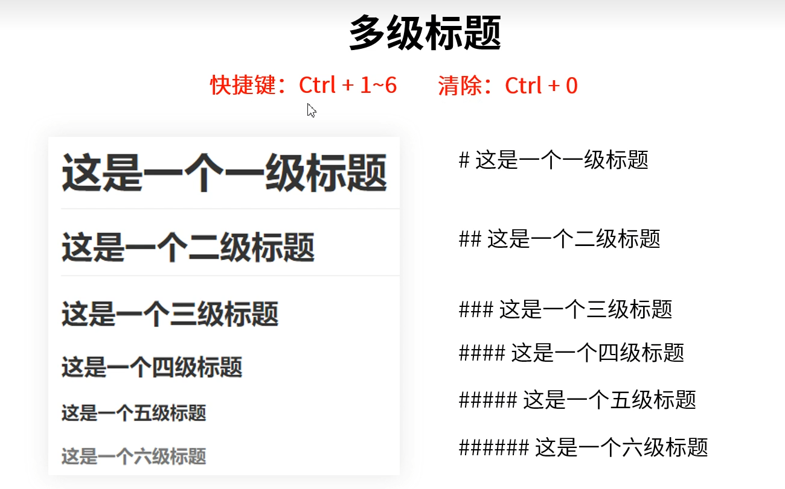
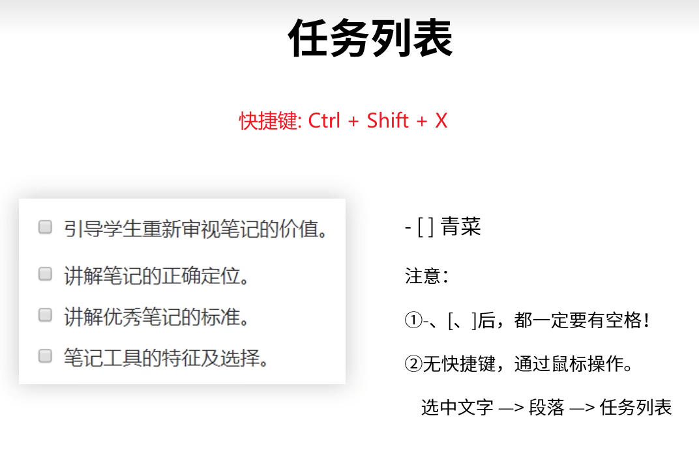
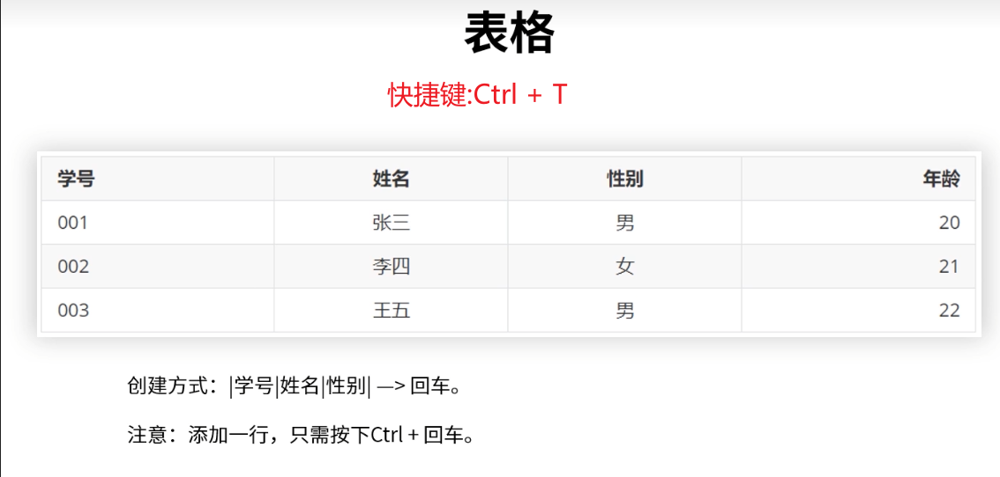
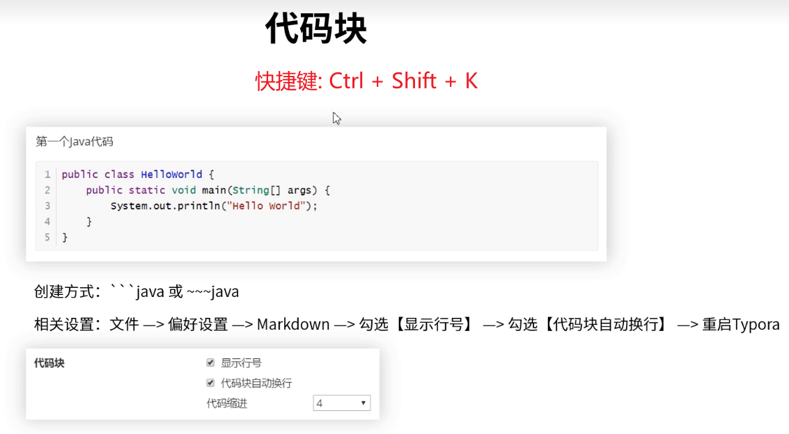
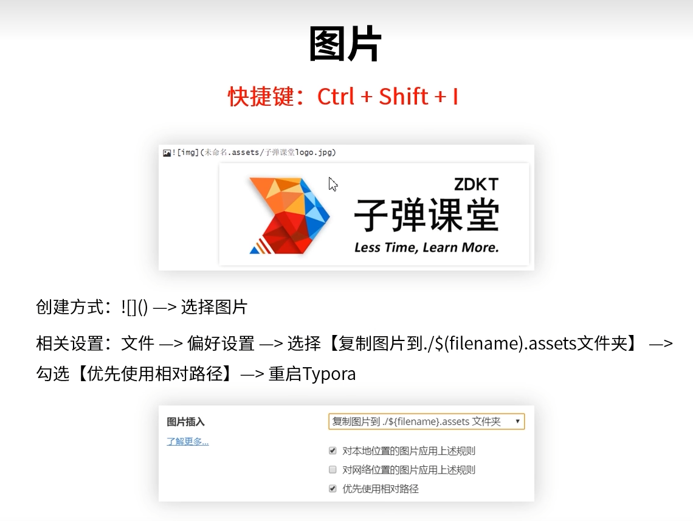

# Markdown

## 00_教程简介

视频地址:[Markdown标记语法Typora编辑器零基础入门新手学习使用总结教程](https://www.bilibili.com/video/BV1jE411n7KJ/?spm_id_from=333.337.search-card.all.click&vd_source=6e9c2de5b89c2ba4e13469e295319397)

## 01_Markdown简介


## 02_多级标题



n个`#` + `space` + `<内容>`+ `enter` = n级`<内容>`标题

## 02_有序列表


1. 打开电视
   1. 插电
   2. 开机
   3. 开门
2. 把大象放进去
3. 关闭冰箱

## 03_无序列表


- 青菜
- 水果	
  1. 苹果
  2. 梨子
  3. 菠萝
     - 国产菠萝
     - 进口菠萝
- 肉

## 04_任务列表



`-` + `space` + `[` + `space` + `]` + `space` = `任务列表`

- [x] 完成任务

- [x] 选中文字

## 05_表格



| 学号 | 姓名 | 性别 | 年龄 |
| :--- | :--- | ---- | ---- |
| 001  | 张三 | 男   | 15   |
| 002  | 李四 | 男   | 16   |

## 06_行内代码


`行内代码`

`快捷键`

## 07_代码块



```java
public class HelloWorld{
	public static void main(String[] args){
		System.out.println("Hello World");
	}
}
```

## 08_图片


