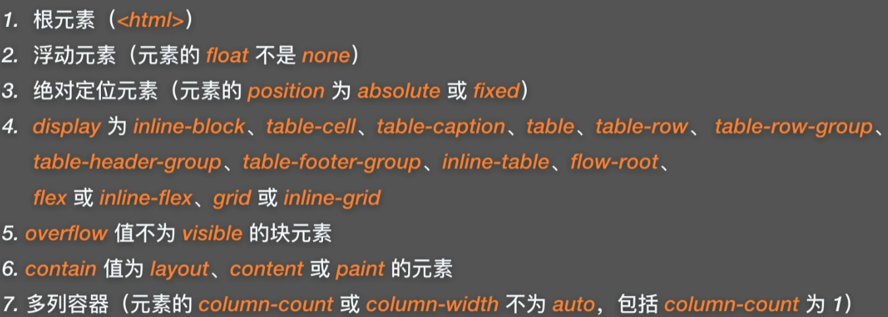
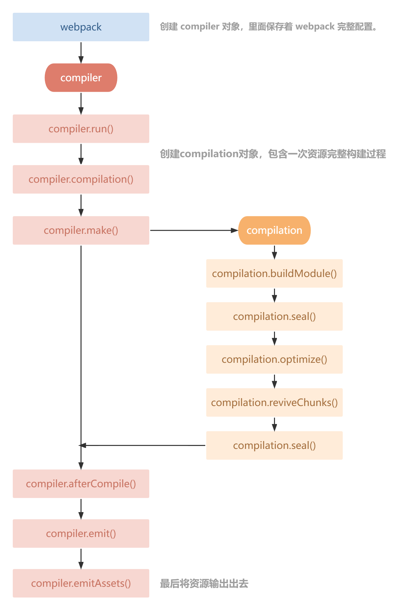

面试时长：1小时30分钟
面试形式：腾讯会议
面试官：2位

1. 前端优化（css层面，js层面，打包）√
2. 闭包原理，作用域链√
3. 原型链√
4. 为什么一个string能使用a.split这样的方法，底层说是包对象，实际上在声明的时候会new String创建
5. 缓存头，什么时候返回200，什么时候返回304√
6. webWorker，webWorker有什么限制√
   - 使用
     - Worker 创建一个worker对象
     - worker.onmessage=func 监听子线程发回的消息
     - worker.postMessage(your message) 向子线程发送消息
     - worker.οnerrοr=func 可以监听错误信息
     - 子线程中需要绑定一个监听函数，监听message事件

   - 场景
     - 计算量庞大
     - worker中可以通过importScript(url)来加载其他文件
     - 可以使用XMLHttpRequest来发送请求

   - webWorker有什么限制
     - 同源限制，分配给worker线程的文件，必须与主线程同源
     - DOM限制，子线程中无法访问主线程所在网页的dom对象，无法使用document、window、parent等对象
     - 通信限制，主线程和子线程必须通过postMessage进行通信
     - 脚本限制，worker线程中不允许使用alert()和confirm()
     - 文件限制，worker线程无法读取本地文件，只能是来自网络的文件

7. 事件循环机制√
8. csrf原理，怎么解决csrf问题，aiti csrfToken，对称公私钥加解密，refer白名单√
9. 跨域原理，怎么解决√
10. 为什么会发送options请求 options预请求,提前试探 https://www.bilibili.com/video/BV1HV4y1K7yZ/?spm_id_from=333.337.search-card.all.click&vd_source=6e9c2de5b89c2ba4e13469e295319397
11. react class组件和函数式组件有什么区别
12. 使用qiankun搭建微应用架构遇到的问题怎么解决，以及应用之间通信方式
13. bfc√

    

14. 首次渲染优化√
15. http2对比http1有什么区别


算法：
给定一个放有字母和数字的数组，找到最长的子数组，且包含的字母和数字的个数相同。
返回该子数组，若存在多个最长子数组，返回左端点下标值最小的子数组。若不存在这样的数组，返回一个空数组。
示例1：
输入: ["A","1","B","C","D","2","3","4","E","5","F","G","6","7","H","I","J","K","L","M"]
输出: ["A","1","B","C","D","2","3","4","E","5","F","G","6","7"]
示例2：
输入: ["A","A"]
输出: []


面试时长：1小时20分钟
面试形式：腾讯会议
面试官：2位
面试题目：
1.强缓存、协商缓存√
2.nodejs 事件循环√
3.箭头函数和普通函数区分√
4.this 指向√
5.call、apply、bind 区别√
6.路由方式
7.hash vs history https://blog.csdn.net/Highning0007/article/details/124125593

hash window.hashchange事件 window.location.hash 兼容性好 不需要服务器配合 不发送请求

history window.popstate事件 history.pushState()/replaceState() 在历史中添加一条记录。pushState()方法不会触发页面刷新，只是导致 History 对象发生变化，地址栏会有变化。 history.forward()/back()go() 兼容性差 需要服务器配合Nigix配置 发送请求 页面不刷新所以不404 刷新后404

```nginx
sverver {
  listen 80;
  servername xxx.com;
    
   location /about {
  	try_files $uri $uri/ /about/index.html;
		}
}
```


8.hash 为什么不需要做 nginx 配置，会发送web请求吗
9.输入url到显示页面√  https://www.bilibili.com/video/BV1V54y1y7c4/?p=3&spm_id_from=pageDriver&vd_source=6e9c2de5b89c2ba4e13469e295319397
10.回流和重绘√ 
11.webpack 构建流程√
12.模块联邦


计算产品部-前端开发-第一面
面试时间：11.29 16:00
面试时长：1小时10分钟
面试形式：视频面试
面试问题：
webpack plugin 和loader区别
webpack plugin 的钩子有哪些
plugins的钩子用过哪些



history 404 如何解决
History 路由和Hash 路由的区别
react 和 vue的diff算法的区别
公司code review 做过些什么事情 https://zhuanlan.zhihu.com/p/396010993

js 事件循环机制
相关于跨域的 什么情况下会跨域：ip 端口 协议 都会导致跨域，二级域名 三级域名也会跨域

算法题：
n 个孩子站成一排。给你一个整数数组 ratings 表示每个孩子的评分。
你需要按照以下要求，给这些孩子分发糖果：
每个孩子至少分配到 1 个糖果。
相邻两个孩子评分更高的孩子会获得更多的糖果。
请你给每个孩子分发糖果，计算并返回需要准备的 最少糖果数目 。
示例 1：
输入：ratings = [1,0,2]
输出：5
解释：你可以分别给第一个、第二个、第三个孩子分发 2、1、2 颗糖果。
示例 2：
输入：ratings = [1,2,2]
输出：4
解释：你可以分别给第一个、第二个、第三个孩子分发 1、2、1 颗糖果。
第三个孩子只得到 1 颗糖果，这满足题面中的两个条件。