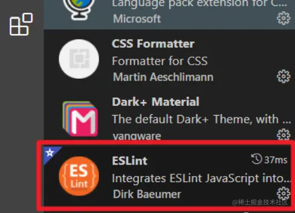
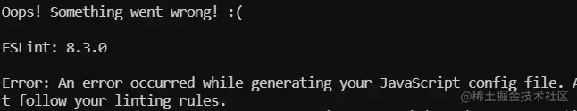
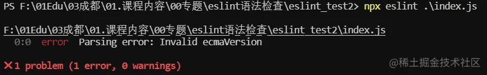
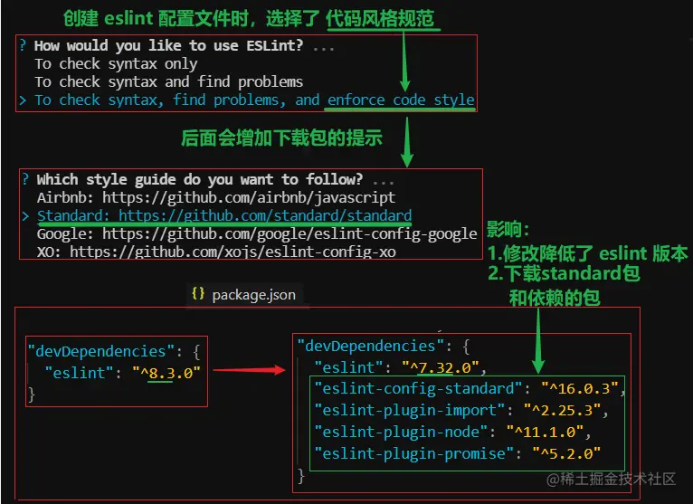
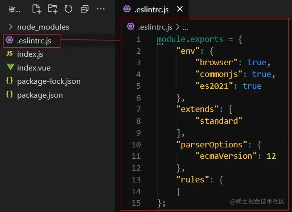

# 【一听就懂】ESLint机制浅析-整体机制与规范包

## 0.教程简介

视频教程:【一听就懂】ESLint详解

视频地址: https://www.bilibili.com/video/BV1Eg411P7gr?p=1&vd_source=6e9c2de5b89c2ba4e13469e295319397

视频作者: [OpenCoder](https://space.bilibili.com/516201363)

笔记地址: https://juejin.cn/post/7037426216671903780

## 1.认识ESLint

> 需要注意的是：ESLint 有两个工具，一个是 模块包 ，一个是 VSCode的扩展工具 本结课主要讲 eslint 模块包

### 1.1 ESLint 包

- 安装方式：
  - a.通过 npm 或 yarn 直接进行 全局 或 项目安装 `npm i eslint -D`
  - b.通过 vue 脚手架 创建项目时 选择安装 eslint 模块包 `vue create 创建项目过程中选择 lint`


### 1.2 VS中ESLint扩展工具

- 安装方式：通过 vscode 搜索安装



## 2.ESLint详解

> 【官网】[eslint.bootcss.com/](https://link.juejin.cn/?target=https%3A%2F%2Feslint.bootcss.com%2F)

### 2.1 介绍


- eslint 本身是一个语法规范检查的包

### 2.2为什么要用ESLint

```
代码千万行，安全第一行；前端不规范，同事两行泪
```

- 统一团队编码规范（命名，众多格式等）
- 统一语法，毕竟es版本已经不少了(var/let....)
- 减少git不必要的提交（如果文件格式不一样，也会被git提交的）
- 避免低级错误
- 在编译时检查语法，而不是等JS引擎运行时才检查

### 2.3 eslint 用法

- 可以手动下载配置
- 可以通过vue脚手架创建项目时自动下载配置

## 3.手动下载配置(原理)

> 【官网】[eslint.bootcss.com/docs/user-g…](https://link.juejin.cn/?target=https%3A%2F%2Feslint.bootcss.com%2Fdocs%2Fuser-guide%2Fgetting-started)
>
> 通过手动下载配置，可以帮我们更好的理解 eslint 的工作

### 3.1 创建项目

- 创建一个测试文件夹：`eslint_test`
- 初始化项目：`npm init -y` (创建 package.json)

### 3.2 ESLint安装

1. 直接在项目中安装eslint包 `npm i eslint -D`
2. 注意安装结果：**node_moduels** 中下载了很多包
   - **.bin/eslint.cmd** 脚本文件，内部通过 **nodejs** 执行 **eslint运行包** 的代码
   - **@eslint包** 用来规范 **eslint配置文件**
   - **eslint开头的包** 是 **eslint运行包**，包含eslint代码


### 3.3 生成ESLint配置文件

> ESLint 可以创建独立的配置文件 **.eslintrc.js**，也可以 直接在 **package.json** 中配置

1. 执行 `node_modules/.bin` 文件夹里的 **eslint脚本** 来**创建配置文件**

   - 包含完整脚本路径的命令：`./node_modules/.bin/eslint --init`

   - 也可以用 **npx** 来执行 **(推荐)**：`npx eslint --init`

     （**npx**是随node一起安装的，能去 **.bin 目录** 里找 目标脚本文件，简化执行脚本的语法）

2. 创建配置文件过程中，需要选择配置：


1. 执行结果：

- 创建了 配置文件 `.eslintrc.js`


- 下载了相关规范包
  - 主要是下载了 standard 语法规范包，而它需要 用到 import、node、promise 插件包


### 3.4 生成配置文件报错

- 在生成 配置文件最后面，虽然文件时有了，但会报出一个错：



- 如果不理，后面检查代码规范时，会导致检查失败： `Invalid ecmaVersion`



- **原因：创建配置文件选项过程中，选择了 强制代码风格规范，进而选择了standard包**
  - 而这个选择，会降低当前项目 eslint版本(8.3 => 7.32)，从而不支持 es13 的语法



### 3.5 解决方案

- 修改生成的配置文件里的 配置项目：`ecmaVersion` ，从 **13 => 12**
- 本质原因：这些 新下载的包 用的还是 eslint 的久版本，而旧版本的 eslint 还不支持 es13


### 3.6 ESLint执行

- 命令：`npx eslint ./需要检查语法的文件路径`
- 如果违法规范，会将错误提示到 终端，说明 eslint 工作正常


## 4.ESLint配置文件入门

> 【官网】[eslint.bootcss.com/docs/user-g…](https://link.juejin.cn/?target=https%3A%2F%2Feslint.bootcss.com%2Fdocs%2Fuser-guide%2Fconfiguring)



### 4.1 配置文件格式

- 我们通过 `npx eslint --init` 创建配置文件时，有提供配置文件的格式给我们选择：
  - .js / .yaml / .json


- eslint 加载的优先级是 ： js > yaml > json，所以我们最好选择 **js格式**

### 4.2 JS格式使用模式

- 我们注意到 配置文件内部使用的 **module.exports** 导出配置数据
- 这是因为 我们在前面 添加配置文件时，选择了 `CommonJS`


- 如果选择了 `JavaScript modules`，那么就会是使用 **export** 导出配置数据
- 推荐：`CommonJS`
  - 由于我们开发时，一般使用的是 vue脚手架，内部webpack打包默认用的是CommonJS
  - 所以 ESLlint配置文件 应尽可能与它保持一致

### 4.3 env节点

```js
"env": {
    "browser": true,
    "commonjs": true,
    "es2021": true
}
复制代码
```

- 由于 ESLint 的各种规范中，一般都不允许使用未在页面内声明的成员
- 而开发中经常会用到 一些运行环境自带的 api，如：
  - 浏览器中的 **window/document** 等
  - nodejs中的**__dirname** 等
  - es2021中的 **WeakRef** 等
- 所以要告诉eslint，当前代码是运行在哪些环境中，这样检查时就不会报错了

### 4.4 globals节点

- 当访问当前源文件内未定义的变量时，[no-undef](https://link.juejin.cn/?target=https%3A%2F%2Feslint.bootcss.com%2Fdocs%2Frules%2Fno-undef) 规则将发出警告。如果你想在一个源文件里使用全局变量，推荐你在 ESLint 中定义这些全局变量，这样 ESLint 就不会发出警告了。你可以使用注释或在配置文件中定义全局变量。

```js
 "globals": {
  "_": true  // 可以读取，可以修改
  "$": false // 可以读取，不能修改
 }
复制代码
```

- 也可以使用 `globals` 节点来手动配置全局成员
- 注意：这个节点需要手动添加，默认是没有的

### 4.5 extends 节点

```js
"extends": [
  "standard" // "eslint-config-standard"
 ]
复制代码
```

- ESLint 检查时用哪些规范呢？通过这个节点可以配置使用 内置规范 还是 第三方规范
  - 这里配置的是 使用 第三方下载的 `eslint-config-standard` 规范
  - 注意：配置 extends时，可以省略 `eslint-config-`，直接写成 `standard`

### 4.6 parserOptions 节点

```js
 "parserOptions": {
  "ecmaVersion": 12
 }
复制代码
```

- ESLint 解析器 解析代码时，可以指定 用哪个 js 的版本
- 注意：这里是指定 检查时按照哪个js版本语法检查，但这里不包含 全局变量
- 全局变量 需要通过 前面的 `env` 节点配置

### 4.7 rules 节点

```js
 "rules": {
 }
复制代码
```

- 两个用法：
  - 不使用 `extend` 节点 配置 **整套的规范**，而是在 `rules`节点中直接配置


- 使用 `extend` 节点 配置 **整套的规范**，在 `rules`节点中修改部分规范的配置 eg：


## 5.ESLint检查语法的规则

> 【官网】[eslint.bootcss.com/docs/rules/](https://link.juejin.cn/?target=https%3A%2F%2Feslint.bootcss.com%2Fdocs%2Frules%2F)
>
> 这些报错的起点在哪？ESLint 是按照什么规范来检查代码的呢？

### 5.1 ESLint语法规范本质

- 就是**【函数】**
- 我们可以通过 看 **ESLint** 源码查看：
  - eslint 内置285个规则，每条规则 都是一个 **create函数**
  - 在进行语法检查时，会将代码转成另一种


## 6. 语法规范包类型

- 前面看到，ESLint 安装时自带280多个规范，而开发时，未必都要使用，各个公司根据自己的习惯选择

- 所以就用了不同的选择组合：

  a. **ESLint内置规范包** ：eslint-all / eslint-recommended

  b. **标准规范包**：eslint-config-standard

  c. **第三方规范包**(google/airbnb/facebook....)

### 6.1 内置规范包

- 已经随eslint一起下载：

  `eslint-all` ：使用全部280多个规则

  `eslint-recommended`：只使用推荐的60个规则

### 6.2 标准规范包(需要下载)

- 包名：`eslint-config-standard`也使用了200多个规则
- 下载方式：
  - 可以在前面创建 eslint配置文件时 选择下载


- 手动下载，官方git地址：[github.com/standard/st…](https://link.juejin.cn/?target=https%3A%2F%2Fgithub.com%2Fstandard%2Fstandard)

  - a.下载包：`npm i eslint-config-standard -D`
  - b.降低eslint版本：`npm i eslint@7.32.0` （standard依赖低版本的eslint）
  - c.修改eslint配置文件中的 es版本：

  

### 6.3 第三方规范包

> 有很多啊，我们就拿最流行的 airbnb 来举例

- 包名：`eslint-config-airbnb-base` ：好多规则，数不过来。。。
- 官方npm地址：[www.npmjs.com/package/esl…](https://link.juejin.cn/?target=https%3A%2F%2Fwww.npmjs.com%2Fpackage%2Feslint-config-airbnb-base)
- 手动下载： a. 查看需要下载的包和版本 `npm info "eslint-config-airbnb-base@latest" peerDependencies`


b.下载 相关包 `npx install-peerdeps --dev eslint-config-airbnb-base`


## 7. 配置规范包

### 7.1 修改 eslint 配置文件

```js
module.exports = {
    "env": {
        "browser": true,
        "commonjs": true,
        "es2021": true
    },
    // "extends": "eslint:all", // 内置：所有规则
    // "extends": "eslint:recommended", // 内置：推荐规则
    "extends": "eslint-config-standard", // 第三方：标准规则
    // "extends": "eslint-config-airbnb-base", // 第三方：airbnb公司规则
    "parserOptions": {
        "ecmaVersion": 12
    },
    "rules": {
    }
};
复制代码
```

### 7.2 运行ESLint

- 使用 eslint 检查 目标 文件或文件夹
- 注意：ESLint 默认只检查 js 文件代码，如果想 检查 vue 或 react文件，需要装其它插件包

```js
npx eslint ./index.js // 检查 目标文件
npx eslint ./src // 检查 目标文件夹 中所有js文件
复制代码
```

### 7.3 测试不同包检查相同代码

- 一段相同代码

```js
   let a = 1;
// delete a
try {
            console.log(a)
} catch (error) {
   
}
const ref = new WeakRef({ name: 'daotin' });
let obj = ref.deref();
if (obj) {
  console.log(obj.name); // daotin
} 

复制代码
```

- 检查结果：严格程度 **all > airbnb-base > standard > recommended**

